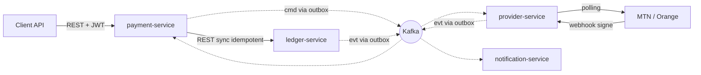

# Open Core Banking

[](https://github.com/JacquesLandryNgandjo/open-core-banking/actions/workflows/build.yml)

Plateforme de paiement en microservices, avec integration Mobile Money (MTN MoMo,
Orange Money — zone CEMAC). Grand livre en partie double immuable, architecture
evenementielle sur Kafka.

> Ce README sera developpe en Phase 6. Il donne pour l'instant l'essentiel :
> ou lire l'architecture, ce qui existe, et comment le faire tourner.

---

## Ce que ce projet cherche a demontrer

Un systeme financier ne se juge pas sur ses fonctionnalites mais sur ce qu'il garantit
quand les choses se passent mal : un client qui reessaie, un operateur qui ne repond
pas, un message livre deux fois, un service qui redemarre au mauvais moment.

Les proprietes suivantes sont implementees **et testees**, pas seulement mentionnees.

| Propriete | Etat | Ou |
|---|---|---|
| Grand livre en partie double, immuable, sans champ solde | Livre | `ledger-service` |
| Invariant d'equilibre verifie par la base, pas seulement par le code | Livre | migration `V3` |
| Immuabilite par triggers **et** par droits PostgreSQL | Livre | migration `V2` et `V5` |
| Idempotence stricte, sure sous concurrence | Livre | `ledger-service` |
| Contre-passation unique, base de la compensation de saga | Livre | `ledger-service` |
| Journal d'audit append-only avec chainage de hachage | Livre | `ledger-service` |
| Transactional Outbox | Phase 2 | `payment-service` |
| Machine a etats a transitions gardees | Phase 2 | `payment-service` |
| Consommateurs Kafka idempotents | Phase 4 | `notification-service` |
| Saga avec compensation | Phase 4 | decaissement |
| Timeout traite comme "inconnu", jamais comme echec | Phase 3 | `provider-service` |
| Callbacks signes **et** polling de reconciliation | Phase 3 | `provider-service` |
| OIDC resource server, portees fines, secrets hors depot | Phase 3 | tous |

---

## Architecture

Le document de reference est [docs/00-architecture-phase0.md](docs/00-architecture-phase0.md).
Il contient le decoupage des services et sa justification, le plan de comptes avec les
ecritures des trois flux, les schemas de donnees, le contrat des evenements Kafka, et
les patterns exigence par exigence.



Deux points de decoupage meritent d'etre lus avant le code :

- **Le grand livre ne detient aucune donnee personnelle.** Un compte designe son
  titulaire par une reference opaque. Ni MSISDN, ni identite, ni statut KYC. C'est ce
  qui permettra d'extraire un service client plus tard sans toucher a la comptabilite.
- **Le transfert portefeuille a portefeuille n'est pas une saga.** C'est une seule
  ecriture equilibree dans une seule base : une transaction ACID suffit. La saga avec
  compensation porte sur le **decaissement**, ou un systeme externe entre en jeu et ou
  aucune transaction distribuee n'est possible. Savoir quand ne pas faire de saga fait
  partie de ce que ce projet cherche a montrer.

---

## Etat d'avancement

| Phase | Contenu | Etat |
|---|---|---|
| 0 | Cadrage, decoupage, contrats d'evenements | Termine |
| 1 | `ledger-service` : comptes, partie double, soldes, API REST | Termine |
| 2 | `payment-service` : idempotence, machine a etats, outbox, Kafka | En cours |
| 3 | `provider-service` : abstraction operateur, webhooks, polling, **securite OIDC** | A venir |
| 4 | `notification-service` et saga de decaissement avec compensation | A venir |
| 5 | Docker Compose, Helm, sondes, observabilite | A venir |
| 6 | Documentation, diagrammes, guide de demarrage | A venir |

---

## Stack

Java 21 · Spring Boot 3.5 · PostgreSQL (une base par service) · Apache Kafka ·
OpenAPI 3 contract-first · Flyway · JUnit 5, Testcontainers, jqwik, ArchUnit ·
Docker, Kubernetes, Helm

Le developpement local se fait sur JDK 25 avec `maven.compiler.release=21`.
La CI compile et execute sur **JDK 21**, qui est la cible : tout ecart de comportement
entre les deux se revele dans le pipeline plutot que tardivement.

---

## Demarrage rapide

Maven n'a pas besoin d'etre installe : le depot embarque le wrapper.

```bash
./mvnw test
```

Les tests unitaires ne demandent aucune infrastructure : domaine comptable, type
`Money`, proprietes generees, regles d'architecture.

```bash
./mvnw verify
```

Ajoute les tests d'integration, qui demandent un daemon Docker (Testcontainers lance un
PostgreSQL reel — la contrainte differee et les droits n'ont aucun sens sans lui).

Pour lancer un service, voir son README : [ledger-service](services/ledger-service/README.md).

---

## Organisation du depot

```
contracts/        contrats OpenAPI et schemas d'evenements — source de verite
platform/         plomberie technique partagee, sans aucune logique metier
services/         services deployables, une base par service
docs/             architecture et decisions
.github/          integration continue
```

**Regle de frontiere, verifiee par ArchUnit et non seulement souhaitee :** aucun service
ne lit la base d'un autre, aucune entite persistante n'est partagee, et `platform/` ne
contient aucune logique metier. C'est ce qui empeche un monorepo de degenerer en
monolithe distribue.

---

## Licence

Apache 2.0
