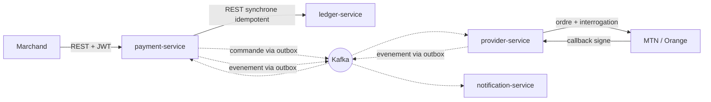

# Open Core Banking

[](https://github.com/LANDRYJACQUES237/open-core-banking/actions/workflows/build.yml)
[](LICENSE)

Plateforme de paiement en microservices, avec integration Mobile Money — MTN MoMo, Orange
Money, zone CEMAC. Grand livre en partie double immuable, architecture evenementielle sur
Kafka.

---

## Le probleme que ce projet prend au serieux

Un systeme financier ne se juge pas sur ses fonctionnalites. Il se juge sur ce qu'il
garantit **quand les choses se passent mal** : un client qui reessaie, un operateur qui ne
repond pas, un message livre deux fois, un service qui redemarre au mauvais moment.

Quatre reponses, qui resument la position de ce projet.

**Un timeout n'est pas un echec.** Quand un operateur ne repond pas, le systeme ne sait
pas si l'argent est parti. Traiter ce silence comme un refus, c'est rembourser un
decaissement peut-etre livre — donc payer deux fois. L'etat s'appelle `UNRESOLVED`, il est
resolu par interrogation de statut, et si le budget d'interrogation s'epuise il devient
`MANUAL_REVIEW`. Jamais `FAILED`.

**Une saga n'a pas de branche « en cas de doute ».** La compensation ne s'execute que sur
un refus **etabli**. Le compte de passage `1900` porte les fonds engages et non livres :
tout montant qui y stationne est une question ouverte, et son solde est la liste des
decaissements en vol. Il n'existe aucune table d'etat de saga a cote de la comptabilite,
parce qu'elle pourrait diverger d'elle.

**Le grand livre ne peut pas etre reecrit, par personne.** Deux couches independantes : des
declencheurs PostgreSQL qui refusent `UPDATE` et `DELETE`, et des droits qui font que
l'utilisateur applicatif n'a meme pas de quoi essayer. Les migrations tournent sous un
**autre utilisateur**, dans une **autre image**, dans un **autre pod** — sans quoi
l'application pourrait retirer ses propres garde-fous.

**Savoir quand ne pas faire de saga.** Le transfert de portefeuille a portefeuille est une
seule ecriture equilibree dans une seule base : une transaction ACID suffit. Y mettre une
saga ajouterait des etats intermediaires, une compensation et une fenetre d'incoherence
pour resoudre un probleme qui n'existe pas.

---

## Ce qui est garanti, et ce qui le prouve

Chaque ligne est implementee **et** couverte. La colonne de droite nomme le test : si elle
etait vide, la ligne serait une intention.

| Propriete | Ce qui la prouve |
|---|---|
| Partie double, montants strictement positifs, direction portant le signe | `DoubleEntryPropertyTest` — proprietes generees |
| Equilibre verifie **par la base**, en contrainte differee au `COMMIT` | `DeferredBalanceConstraintIT` |
| Immuabilite par declencheurs **et** par droits PostgreSQL | `ImmutabilityIT` |
| Solde sans champ mutable, consolide par instantanes | `BalanceSnapshotIT` |
| Contre-passation unique, base de la compensation | `ReversalIT` |
| Journal d'audit chaine par hachage, scelle periodiquement | `AuditTrailIT` |
| Idempotence stricte, sure sous 32 requetes simultanees | `ConcurrentIdempotencyIT` |
| Idempotence **cloisonnee par appelant** : deux marchands, meme cle, deux transactions | `PaymentSecurityIT` |
| Transactional Outbox : aucune publication hors transaction | `OutboxAtomicityIT` |
| Machine a etats gardee, etats terminaux sans sortie | `TransactionStateMachineTest` |
| Saga de decaissement avec compensation | `DisbursementSagaIT` |
| Decouvert impossible sous concurrence reelle | `DisbursementConcurrencyIT`, `PgAdvisoryWalletLockTest` |
| Aucun double debit apres une panne entre l'ecriture distante et la validation locale | `DisbursementCrashRecoveryIT` |
| Transfert atomique, **sans** saga | `TransferIT` |
| Un timeout ne conclut rien ; une erreur serveur n'est pas un refus | `CollectionExecutionIT` — `operatorHangsAndNothingIsConcluded`, `serverErrorIsNotARejection`, `exhaustedBudgetYieldsUnresolvedNotFailure` |
| L'interrogation de statut resout ce que le timeout a laisse ouvert | `CollectionExecutionIT` — `pollingResolvesWhatTheTimeoutLeftOpen` |
| Webhooks a signature verifiee, fenetre de rejeu, corps altere refuse | `WebhookIT` |
| Consommateurs idempotents : une redelivraison ne notifie qu'une fois | `NotificationConsumptionIT` — `redeliveryNotifiesOnlyOnce` |
| File de rebut pour ce qui n'est pas lisible | `NotificationConsumptionIT` — `unreadableMessageGoesToTheDeadLetterTopic` |
| Numero de telephone **jamais conserve**, masque dans les reponses et absent des messages | `MsisdnTest`, `NotificationComposerTest` |
| Contrat d'evenements opposable, compatibilite verifiee | `EventContractTest` |
| OIDC, audience validee, portees fines, aucun secret dans le depot | `LedgerSecurityIT`, `PaymentSecurityIT`, `ProviderSecurityIT`, `NotificationSecurityIT` |
| Vivacite sans dependance externe, disponibilite avec | `ProbeSemanticsIT` |
| Frontieres entre services et purete de `platform/` | 17 regles ArchUnit, dans les quatre services |
| Une configuration de frais a zero ne casse rien | `ZeroFeeIT` |

**46 classes de test, 284 methodes.** Les tests d'integration demarrent de vrais
PostgreSQL et de vrais Kafka par Testcontainers : une contrainte differee, des droits
PostgreSQL et un rebalancement de consommateurs n'ont aucun sens face a une doublure.

---

## Architecture



`ledger-service` n'a **aucune** dependance a Kafka, et ce n'est pas un oubli : rien n'a
besoin d'etre notifie d'une ecriture comptable. Ce qui interesse le reste du systeme, ce
sont les evenements metier de `payment-service`.

**[docs/ARCHITECTURE.md](docs/ARCHITECTURE.md)** contient les niveaux C4 — contexte,
conteneurs, composants de `payment-service` — la machine a etats complete, et le
decaissement de bout en bout avec ses trois issues.

Deux points de decoupage meritent d'etre lus avant le code :

- **Le grand livre ne detient aucune donnee personnelle.** Un compte designe son titulaire
  par une reference opaque. Ni numero, ni identite, ni statut KYC. C'est ce qui permettra
  d'extraire un service client plus tard sans toucher a la comptabilite.
- **L'interdiction de decouvert ne vit pas dans le grand livre.** Elle vit dans
  `payment-service`, sous verrou de base. Un garde-fou de decouvert cote comptabilite
  l'empecherait un jour d'enregistrer un solde negatif legitime — frais appliques apres
  coup, regularisation, correction. Ce n'est pas son role de decider.

---

## Demarrer

### Les tests, sans rien installer

Maven n'est pas necessaire : le depot embarque le wrapper.

```bash
./mvnw test
```

Domaine comptable, type `Money`, proprietes generees, regles d'architecture. Aucune
infrastructure.

```bash
./mvnw verify
```

Ajoute les tests d'integration, qui demandent un demon Docker.

### La plateforme complete

```bash
docker compose -f deploy/docker/docker-compose.yml up --build
```

Quatre services, quatre bases, un courtier, un fournisseur d'identite avec son realm.
Les ports publies sont configurables. Voir **[deploy/README.md](deploy/README.md)** pour
le detail, et notamment pourquoi les migrations tournent dans une image separee.

Pour lancer un service seul, voir son README :
[ledger-service](services/ledger-service/README.md) ·
[payment-service](services/payment-service/README.md) ·
[provider-service](services/provider-service/README.md) ·
[notification-service](services/notification-service/README.md)

---

## Etat d'avancement

| Phase | Contenu | Etat |
|---|---|---|
| 0 | Cadrage, decoupage, contrats d'evenements | Termine |
| 1 | `ledger-service` : comptes, partie double, soldes, API REST | Termine |
| 2 | `payment-service` : idempotence, machine a etats, outbox, Kafka | Termine |
| 3 | `provider-service` : abstraction operateur, webhooks, interrogation, securite OIDC | Termine |
| 4 | Saga de decaissement, transfert atomique, `notification-service` | Termine |
| 5 | Images, Compose, chart Helm, sondes, metriques metier | Termine |
| 6 | Documentation, diagrammes C4, decisions, guide de demarrage | En cours |

### Ce qui n'est pas fait, et qu'il serait malhonnete de laisser croire

- **Aucune pile d'observabilite n'est deployee.** Les services exposent
  `/actuator/prometheus` avec des metriques metier ; il n'y a ni tableau de bord, ni
  traces distribuees.
- **Le relais d'outbox interroge la table.** Debezium etait prevu ; la table en respecte la
  convention, mais le remplacement n'a pas eu lieu.
- **Le chart Helm n'a jamais tourne sur un vrai cluster.** Il est verifie a chaque push par
  rendu et par `kubeconform`, ce qui valide les manifestes produits, pas leur comportement
  sous un ordonnanceur.
- **Les operateurs sont simules.** Aucun accord commercial avec MTN ou Orange ; le
  simulateur reproduit leurs reponses documentees, y compris leurs silences.

---

## Organisation du depot

```
contracts/        contrats OpenAPI et schemas d'evenements — source de verite
platform/         plomberie technique partagee, sans aucune logique metier
services/         services deployables, une base par service
deploy/           images, Compose, chart Helm
docs/             architecture et decisions
.github/          integration continue
```

**Regle de frontiere, verifiee par ArchUnit et non seulement souhaitee :** aucun service ne
lit la base d'un autre, aucune entite persistante n'est partagee, et `platform/` ne
contient aucune logique metier. C'est ce qui empeche un monorepo de degenerer en monolithe
distribue.

---

## Stack

Java 21 · Spring Boot 3.5 · PostgreSQL, une base par service · Apache Kafka ·
OpenAPI 3 contract-first · Flyway · JUnit 5, Testcontainers, jqwik, ArchUnit ·
Docker, Kubernetes, Helm

Le developpement local se fait sur JDK 25 avec `maven.compiler.release=21`. L'integration
continue compile **et execute** sur JDK 21, qui est la cible : tout ecart de comportement
entre les deux se revele dans le pipeline plutot que tardivement sur un environnement reel.

---

## Licence

[Apache 2.0](LICENSE).
