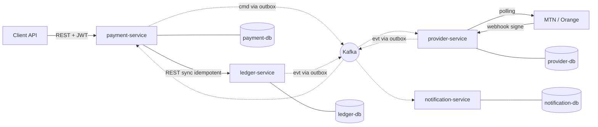
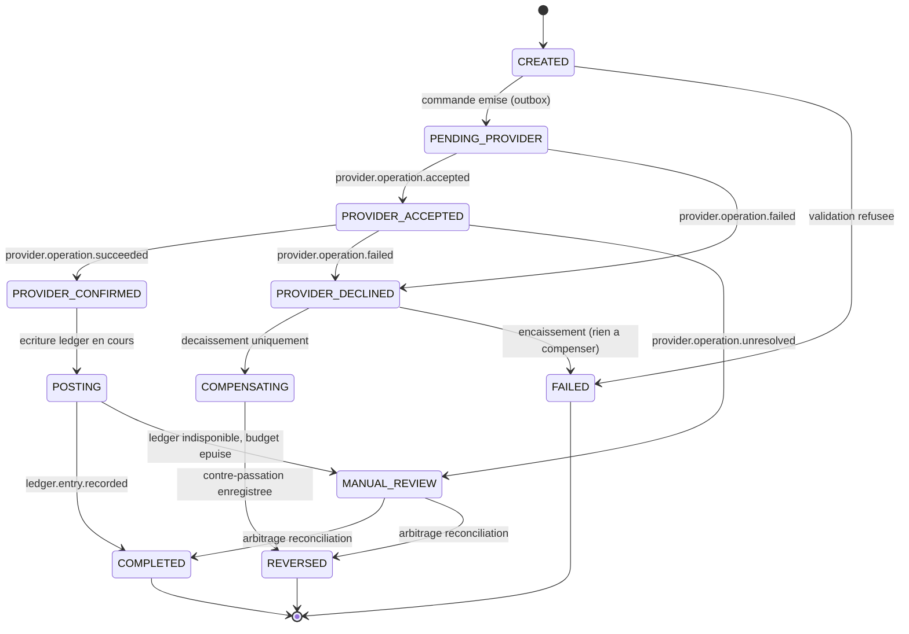

# Open Core Banking — Document d'architecture (Phase 0)

> **Document historique. Il décrit ce qui allait être construit, pas ce qui l'a été.**
>
> Écrit le 2026-08-21, avant la première ligne de code, et conservé **tel quel**.
>
> Pour l'état courant du système, lire dans cet ordre : le [README racine](../README.md),
> l'[architecture construite](ARCHITECTURE.md), les [décisions](adr/README.md), le
> [guide de démarrage](DEMARRAGE.md), puis le README du service qui vous intéresse.

Ce document n'est pas mis à jour, et c'est délibéré. Le réécrire au fil des phases
effacerait la seule chose qu'il apporte encore : la trace de ce qui a été anticipé, de ce
qui a été mal anticipé, et de ce qui n'avait pas été vu. Un document d'architecture
retouché après coup a toujours raison ; c'est ce qui le rend inutile.

Il reste la meilleure lecture pour trois choses, qui n'ont pas bougé : le **modèle
comptable** (§4), les **schémas de données** (§5) et le **contrat d'événements** (§6).

### Ce que le code a tranché autrement

| Où | Ce que ce document annonçait | Ce qui s'est passe |
|---|---|---|
| D7, §12 | Debezium CDC remplace le polling en Phase 5 | **Pas fait.** Le relais interroge toujours la table. La table reste compatible Debezium, mais le remplacement n'a pas eu lieu et ne doit pas être présenté comme acquis |
| §12 | Phase 5 : Prometheus, Grafana, Jaeger | **Partiel.** Les services exposent `/actuator/prometheus` avec des métriques métier ; aucune pile d'observabilité n'est déployée, et aucune trace distribuée n'existe |
| §12 | ADR rédigés **au fil de l'eau**, pas à la fin | **Pas tenu.** Voir la note ci-dessous |
| §13 Q1–Q8 | Huit questions ouvertes | Toutes tranchées, dans le sens recommandé. Q8 : JDK 21 en cible, JDK 25 en local |

Trois règles importantes n'apparaissent nulle part ici, parce qu'elles ont été découvertes
en construisant : le **verrou de portefeuille en base** (l'interdiction de découvert n'était
pas modélisée), l'**identifiant de transaction dérivé de la clé d'idempotence** (une panne
entre l'écriture distante et la validation locale rendait un double débit possible), et le
fait qu'une **saga n'a pas de branche « en cas de doute »**.

### Sur les ADR écrits à la fin

Le §12 de ce document met en garde contre exactement ce qui a été fait : les ADR ont été
rédigés en Phase 6, pas au moment des décisions. La mise en garde était juste, et elle est
laissée ici plutôt que retirée.

Ce qui limite les dégâts : chaque ADR renvoie au **commit** où la décision a pris effet, et
ces messages de commit sont contemporains de la décision. Chaque ADR doit aussi nommer
l'alternative réellement écartée et **ce qui le ferait revenir** — sans quoi il ne serait
qu'une justification, et n'aurait pas été écrit.

---

## 1. Résumé des décisions

| # | Décision | Retenu | Alternative écartée | Raison |
|---|---|---|---|---|
| D1 | Découpage | 4 services : `ledger`, `payment`, `provider`, `notification` | 5–6 services (customer/wallet séparé) | Le coût d'exploitation d'un service supplémentaire n'est pas payé par un gain de découplage à ce stade |
| D2 | Frontière du ledger | Le ledger ne connaît **aucune donnée client** (pas de MSISDN, pas de KYC) | Ledger = comptes + clients | Un grand livre pollué par de la donnée client devient impossible à auditer |
| D3 | `provider-service` | Service séparé | Module Maven dans `payment-service` | Il expose un ingress **public** (webhooks) et détient les secrets opérateurs : frontière de sécurité réelle, pas cosmétique |
| D4 | payment → ledger | **REST synchrone idempotent** | Commande Kafka + événement de réponse | Le ledger doit rendre un verdict immédiat (solde insuffisant). L'idempotence rend le rejeu sûr |
| D5 | payment → provider | **Kafka via outbox** | Appel REST synchrone | Un appel HTTP dans ou après une transaction DB est le dual-write que l'outbox existe pour supprimer |
| D6 | Dépôt | **Monorepo Maven multi-modules** | Repos séparés + repo de contrats versionné | Un seul développeur, un seul clone pour un recruteur, contrat + producteur + consommateur modifiés dans un même commit |
| D7 | Relais outbox | Polling `FOR UPDATE SKIP LOCKED` | Debezium CDC | Table conçue compatible Debezium ; le CDC devient un remplacement de composant en Phase 5, pas une réécriture |
| D8 | Sérialisation événements | JSON + JSON Schema versionné dans `contracts/` | Avro + Schema Registry | Lisible, diffable en revue, testable en CI. Le Schema Registry est une évolution, pas un prérequis |
| D9 | Modèle de montant | `direction DR/CR` + montant strictement positif, `NUMERIC(23,4)` | Montant signé | Modèle comptable canonique ; l'invariant `Σ DR = Σ CR` est vérifiable en base |
| D10 | Passerelle API | **Aucune** en v1 : Ingress K8s + chaque service est resource server OIDC | Spring Cloud Gateway | Valider le JWT dans chaque service (zero trust) est de toute façon obligatoire ; la gateway n'ajouterait qu'un SPOF |

---

## 2. Critique du découpage proposé

Ta proposition est bonne. Trois points la fragilisent, et un quatrième mérite d'être dit franchement.

### 2.1 « ledger-service — comptes clients et portefeuilles électroniques »

C'est le point le plus dangereux. Deux notions différentes sont fusionnées :

- un **compte comptable** (une ligne du plan de comptes, un côté normal, une devise) ;
- un **portefeuille client** (un produit commercial : titulaire, MSISDN, statut KYC, plafonds, gel).

Si le ledger porte les deux, sa base finit avec `phone_number`, `kyc_status`, `daily_limit`. À ce moment-là le grand livre n'est plus auditable indépendamment, il subit les migrations du produit, et il devient impossible de dire « voici la vérité financière » sans embarquer des données personnelles.

**Retenu :** le ledger ne connaît qu'un `owner_ref` opaque. Aucune donnée personnelle dans `ledger-db`. Le MSISDN est une **donnée de transaction** (fournie dans la requête d'encaissement ou de décaissement), portée par `payment-service` et `provider-service`, jamais par le ledger. Un `customer-service` pourra être extrait plus tard sans toucher au ledger — c'est précisément ce que cette frontière protège.

### 2.2 `provider-service` : service ou bibliothèque ?

Le débat est légitime : un adaptateur opérateur est souvent une couche anticorruption, donc un module. Trois arguments font pencher vers le service séparé :

1. **Exposition réseau.** Les webhooks opérateurs entrent depuis Internet. Ils justifient un ingress public, des règles WAF, un rate-limit, une politique réseau distincte. `payment-service` doit rester purement interne.
2. **Secrets.** Les identifiants MTN et Orange ne doivent exister que dans un seul Secret Kubernetes, monté par un seul déploiement.
3. **Cycle de vie.** C'est la brique qui sera réécrite quand tu obtiendras les vrais accès API. La remplacer sans redéployer le moteur de paiement est exactement l'argument microservice.

Contrepartie assumée : un saut réseau de plus dans le chemin de l'argent. Il est mitigé par le fait que ce saut est **asynchrone** (Kafka) et donc tolérant à l'indisponibilité.

### 2.3 La réconciliation n'est pas optionnelle

Tu la listes en « plus tard éventuellement ». Or ton exigence n°7 (« un mécanisme de réconciliation tranche ») la rend obligatoire dès la Phase 3. Distinction utile :

- **Réconciliation transactionnelle** (obligatoire, Phase 3) : le poller de `provider-service` interroge l'opérateur jusqu'à obtenir un statut définitif pour chaque opération non résolue. C'est ce qui sort une transaction de l'état `UNKNOWN`.
- **Réconciliation de relevé** (optionnelle, Phase 5+) : un job quotidien compare le relevé de l'opérateur avec nos écritures et produit un rapport d'écarts. C'est un `reconciliation-service` séparé, et c'est un excellent différenciateur de portfolio.

### 2.4 Le transfert portefeuille-à-portefeuille n'est pas une saga

Point de désaccord explicite, à trancher ensemble.

Ton exigence n°6 cite « un transfert qui débite ici et crédite là » comme cas d'usage de saga. Mais dans l'architecture retenue, un transfert entre deux portefeuilles est **une seule écriture équilibrée dans une seule base** :

```
DR  2100.A  Portefeuille A                 2 020
    CR  2100.B  Portefeuille B                 2 000
    CR  4100    Produits de commissions           20
```

Une transaction ACID PostgreSQL suffit. Construire une saga par-dessus serait de la mise en scène d'architecture : plus de code, plus de latence, plus de fenêtres d'incohérence, pour résoudre un problème qui n'existe pas. Un relecteur technique le remarquera, et ce sera un point négatif, pas positif.

**Le vrai cas de saga avec compensation, c'est le décaissement** :

1. `payment-service` débite le portefeuille client dans le ledger (engagement) ;
2. il demande à l'opérateur de payer — un système externe, hors transaction ;
3. si l'opérateur refuse **définitivement**, il faut compenser par une **contre-passation** (une nouvelle écriture équilibrée qui annule l'effet, jamais un `DELETE`).

C'est une vraie saga : deux systèmes hétérogènes, pas de 2PC possible, compensation métier explicite. Elle démontre exactement ce que tu veux démontrer, et elle est honnête. Je propose de déplacer la saga du transfert vers le décaissement, et de garder le transfert comme démonstration inverse : **savoir quand ne pas faire de saga**. C'est un excellent paragraphe de README.

---

## 3. Découpage retenu et frontières



| Service | Possède (source de vérité) | Ne possède jamais |
|---|---|---|
| **ledger-service** | Plan de comptes, écritures, lignes d'écriture, soldes dérivés, contre-passations | MSISDN, KYC, statut de transaction métier, notion d'opérateur |
| **payment-service** | Transaction de paiement, statut et machine à états, clés d'idempotence, instance de saga, frais calculés | Le solde (il le demande), le protocole opérateur |
| **provider-service** | Opération opérateur, référence opérateur, callbacks bruts, planification du polling, secrets opérateurs | Le sens métier de la transaction, l'écriture comptable |
| **notification-service** | Notifications émises, préférences de canal | Toute décision financière |

**Règle de frontière opposable :** aucun service ne lit la base d'un autre. Aucune entité JPA n'est partagée entre deux bases. Les modules communs ne contiennent que de la plomberie technique et des DTO d'événements — **jamais de logique métier**. C'est la règle qui empêche un monorepo de dégénérer en monolithe distribué.

---

## 4. Modèle comptable

### 4.1 Plan de comptes

| Code | Libellé | Type | Côté normal | Rôle |
|---|---|---|---|---|
| `1100` | Float MTN MoMo | ASSET | DR | Notre encaisse détenue chez MTN |
| `1101` | Float Orange Money | ASSET | DR | Idem Orange |
| `1200` | Compte bancaire de règlement | ASSET | DR | Hors périmètre v1 |
| `1900` | Compte de passage décaissements | ASSET | DR | Fonds engagés, non encore livrés |
| `2100.{walletId}` | Portefeuille client | LIABILITY | CR | **L'argent du client est notre dette** |
| `2900` | Encaissements non affectés | LIABILITY | CR | Argent reçu sans transaction identifiée (issu de la réconciliation) |
| `4100` | Produits de commissions | REVENUE | CR | Nos frais |
| `5100` | Charges de commissions opérateur | EXPENSE | DR | Ce que l'opérateur nous prélève |

Le point non évident, et celui qui distingue un vrai système bancaire d'un CRUD : **un portefeuille client est un compte de passif**. Le crédit d'un client augmente notre dette envers lui. Un développeur qui modélise le portefeuille en actif produit un bilan faux.

### 4.2 Les trois flux en écritures

**Encaissement** — le client envoie 10 000 XAF, nos frais 100, commission MTN 150.

| Compte | DR | CR |
|---|---:|---:|
| `1100` Float MTN | 9 850 | |
| `5100` Charges commission opérateur | 150 | |
| `2100.C` Portefeuille client | | 9 900 |
| `4100` Produits de commissions | | 100 |
| **Total** | **10 000** | **10 000** |

**Décaissement** — 5 000 vers le MSISDN du client, nos frais 50, commission MTN 25. Deux écritures, plus une troisième si compensation.

*Écriture 1 — à l'initiation (engagement)*

| Compte | DR | CR |
|---|---:|---:|
| `2100.C` Portefeuille client | 5 050 | |
| `1900` Passage décaissements | | 5 000 |
| `4100` Produits de commissions | | 50 |

*Écriture 2 — sur confirmation opérateur*

| Compte | DR | CR |
|---|---:|---:|
| `1900` Passage décaissements | 5 000 | |
| `5100` Charges commission opérateur | 25 | |
| `1100` Float MTN | | 5 025 |

*Écriture 3 — sur échec définitif (compensation de la saga)*

| Compte | DR | CR |
|---|---:|---:|
| `1900` Passage décaissements | 5 000 | |
| `4100` Produits de commissions | 50 | |
| `2100.C` Portefeuille client | | 5 050 |

L'écriture 1 n'est **jamais** modifiée ni supprimée. L'écriture 3 la contre-passe et porte `reverses_entry_id` vers elle. C'est exactement ce qu'exige un audit : on ne réécrit pas l'histoire, on la corrige par une nouvelle ligne.

**Transfert A → B** — 2 000 XAF, frais 20 : une seule écriture équilibrée, une seule transaction ACID (voir §2.4).

### 4.3 Règles invariantes

1. `Σ montants DR = Σ montants CR` pour chaque écriture — vérifié dans le domaine **et** par une contrainte différée en base (`CONSTRAINT TRIGGER ... DEFERRABLE INITIALLY DEFERRED`, évaluée au COMMIT). Le contrôle applicatif seul ne suffit pas : une insertion manuelle ou un bug de mapping le contournerait.
2. `amount > 0` toujours. La direction porte le signe.
3. Une écriture ne mélange pas les devises (v1). Une conversion de devise passera par des comptes de position de change, hors périmètre.
4. **Échelle par devise** : le XAF n'a pas de décimales. Le stockage est `NUMERIC(23,4)` pour rester générique, mais un validateur rejette une écriture XAF non entière. `BigDecimal` avec échelle explicite partout, jamais `double`, jamais `float`, et `RoundingMode` explicite dans tout calcul de frais.
5. Aucun champ solde mutable. Le solde est `Σ signed_amount`.

### 4.4 Performance du solde sans champ mutable

Sommer toutes les écritures d'un compte est O(n) et devient inacceptable. Solution retenue : **instantanés de solde**.

`account_balance_snapshot(account_id, up_to_entry_seq, balance, computed_at)` — un job périodique fige le solde jusqu'à un numéro de séquence. Le solde courant vaut `snapshot.balance + Σ écritures dont entry_seq > up_to_entry_seq`.

L'instantané est un **cache reconstructible**, pas une source de vérité : un test doit prouver qu'on peut le supprimer entièrement et retrouver exactement le même solde. Cette propriété est ce qui rend la table légitime dans un système « sans champ solde ».

---

## 5. Schémas de données

Une base par service, un rôle applicatif par base, migrations Flyway par service. En développement local, une seule instance PostgreSQL héberge les 4 bases avec 4 rôles distincts et **aucun droit croisé** — compaction assumée pour le poste de dev ; en Kubernetes, chaque service reçoit sa propre instance.

### 5.1 `ledger-db`

```sql
account(
  id uuid PK, account_number text UNIQUE, account_type text,   -- ASSET|LIABILITY|REVENUE|EXPENSE|EQUITY
  normal_side char(2), currency char(3), owner_ref text NULL,  -- opaque, jamais de PII
  status text, parent_id uuid NULL, created_at timestamptz, version bigint)

journal_entry(                                                  -- IMMUABLE
  id uuid PK, entry_seq bigserial UNIQUE, entry_ref text UNIQUE,
  idempotency_key text UNIQUE NOT NULL,                         -- garde-fou ultime anti-double-ecriture
  transaction_ref text, reverses_entry_id uuid NULL UNIQUE,     -- une ecriture ne se contre-passe qu'une fois
  description text, value_date date, posted_at timestamptz,
  source_service text, correlation_id uuid, created_at timestamptz)

posting_line(                                                   -- IMMUABLE
  id uuid PK, journal_entry_id uuid FK, line_no int,
  account_id uuid FK, direction char(2) CHECK (direction IN ('DR','CR')),
  amount numeric(23,4) CHECK (amount > 0), currency char(3),
  signed_amount numeric(23,4) GENERATED,
  UNIQUE(journal_entry_id, line_no))

account_balance_snapshot(account_id, up_to_entry_seq, balance, computed_at)
outbox_event(...)   audit_log(...)
```

**Immuabilité forcée en base** : le rôle applicatif reçoit `GRANT SELECT, INSERT` sur `journal_entry` et `posting_line`, et **pas** `UPDATE` ni `DELETE`. Doublé d'un trigger `BEFORE UPDATE OR DELETE` qui lève une exception. Testable : un test JDBC brut tente un `UPDATE` et attend l'échec.

### 5.2 `payment-db`

```sql
payment_transaction(
  id uuid PK, external_ref text, type text,          -- COLLECTION|DISBURSEMENT|TRANSFER
  status text, amount numeric(23,4), currency char(3), fee_amount numeric(23,4),
  debit_account_ref text, credit_account_ref text,
  provider_code text, payer_msisdn_enc bytea,        -- chiffre au repos
  provider_ref text, failure_code text,
  created_at, updated_at, version bigint)            -- @Version : verrou optimiste

idempotency_record(
  id uuid PK, scope text, key text, request_hash text,
  status text,                                        -- IN_PROGRESS|COMPLETED
  http_status int, response_body jsonb, resource_id uuid,
  created_at, expires_at, UNIQUE(scope, key))         -- scope = clientId, anti-collision inter-tenants

transaction_state_transition(                          -- APPEND-ONLY
  id, transaction_id, from_status, to_status, trigger_event, accepted boolean,
  rejection_reason, occurred_at, actor)                -- on journalise AUSSI les transitions refusees

saga_instance(id, transaction_id, saga_type, current_step, status, created_at, updated_at)
saga_step(id, saga_instance_id, step_name, status, compensation_status, attempts, last_error, updated_at)

processed_message(consumer_group text, event_id uuid, processed_at,
                  PRIMARY KEY(consumer_group, event_id))
outbox_event(...)   audit_log(...)
```

Journaliser les transitions **refusées** est ce qui rend l'exigence n°3 démontrable : un callback tardif produit une ligne `accepted = false, rejection_reason = 'TERMINAL_STATE'`. La preuve est en base, pas dans un log.

### 5.3 `provider-db`

```sql
provider_operation(
  id uuid PK, transaction_id uuid, provider_code text, operation_type text,
  provider_ref text, status text, attempt_count int,
  last_polled_at, next_poll_at, poll_attempts int, poll_budget_exhausted boolean,
  request_hash text, created_at, updated_at, version bigint,
  UNIQUE(provider_code, transaction_id))              -- idempotence cote operateur

provider_callback(                                     -- brut, conserve pour forensique
  id uuid PK, provider_code text, provider_event_id text, external_ref text,
  signature text, signature_valid boolean, raw_payload jsonb,
  received_at, processed boolean,
  UNIQUE(provider_code, provider_event_id))            -- deduplication des callbacks rejoues

provider_statement_line(...)                           -- reconciliation de releve, Phase 5+
simulator_scenario(id, match_kind, match_value, behaviour, delay_ms, enabled)
processed_message(...)  outbox_event(...)  audit_log(...)
```

**Simulateur pilotable** : le comportement est déclenché par une convention sur le montant ou le suffixe du MSISDN — technique réellement utilisée par les sandbox des PSP. Exemple : montant terminant par `99` → timeout, `98` → échec, MSISDN terminant par `0000` → callback dupliqué. Aucun besoin d'une API d'administration pour piloter les tests, et le README peut donner les recettes.

### 5.4 `notification-db`

```sql
notification(id, transaction_id, channel, recipient_masked, template_code,
             status, attempts, sent_at)
processed_message(consumer_group, event_id, processed_at,
                  PRIMARY KEY(consumer_group, event_id))
```

### 5.5 Tables transverses (identiques dans chaque service)

```sql
outbox_event(
  id uuid PK, aggregate_type text, aggregate_id text, event_type text,
  topic text, partition_key text, payload jsonb, headers jsonb,
  created_at timestamptz, published_at timestamptz NULL,
  attempts int DEFAULT 0, last_error text)
-- index partiel : CREATE INDEX ... ON outbox_event(created_at) WHERE published_at IS NULL

audit_log(                                             -- APPEND-ONLY, chainage de hachage
  id uuid PK, seq bigserial, occurred_at, actor_type, actor_id,
  action, resource_type, resource_id, correlation_id,
  before jsonb, after jsonb, prev_hash text, hash text)
```

Le chaînage `hash = SHA256(seq || contenu || prev_hash)` rend toute suppression ou modification de ligne détectable. C'est bon marché à implémenter et c'est exactement ce qu'un auditeur demande.

---

## 6. Contrats d'événements Kafka

### 6.1 Conventions de nommage

`ocb.<kind>.<domaine>.v<majeure>` où `kind` vaut `evt` (fait accompli) ou `cmd` (intention adressée à un service précis).

Un topic **par agrégat**, pas par type d'événement : les événements d'une même transaction restent ordonnés parce qu'ils partagent la clé de partition. Le type est porté par l'en-tête et le champ `eventType`.

| Topic | Producteur | Consommateurs | Clé de partition | Partitions | Rétention |
|---|---|---|---|---|---|
| `ocb.cmd.provider.v1` | payment | provider | `transactionId` | 6 | 7 j |
| `ocb.evt.payment.v1` | payment | notification, (reconciliation) | `transactionId` | 6 | 30 j |
| `ocb.evt.provider.v1` | provider | payment | `transactionId` | 6 | 30 j |
| `ocb.evt.ledger.v1` | ledger | notification, (reconciliation) | `accountId` | 6 | compaction désactivée, 90 j |
| `<topic>.dlq` | consommateurs | supervision humaine | idem | 1 | 30 j |

Toutes les partitions à `replication.factor=1` en local, `3` en Kubernetes. `min.insync.replicas=2`, producteur en `acks=all`, `enable.idempotence=true`, `max.in.flight.requests.per.connection=5`.

### 6.2 Enveloppe commune

Toute charge utile publiée respecte la même enveloppe (schéma `contracts/events/envelope.schema.json`) :

```json
{
  "eventId": "018f2c...",
  "eventType": "payment.collection.completed",
  "eventVersion": 1,
  "occurredAt": "2026-08-21T10:14:52.113Z",
  "aggregateType": "PaymentTransaction",
  "aggregateId": "7c9e...",
  "correlationId": "3b1a...",
  "causationId": "9d44...",
  "producer": "payment-service",
  "payload": { }
}
```

- `eventId` est **la clé de déduplication** côté consommateur : c'est lui qui va dans `processed_message`.
- `correlationId` traverse tout le flux, du premier appel REST à la notification finale. C'est ce qui rend une transaction traçable de bout en bout dans les logs des 4 services.
- `causationId` désigne l'événement qui a causé celui-ci. Il permet de reconstruire l'arbre causal d'une transaction — très parlant en démonstration.
- En-têtes Kafka : `ce_id`, `ce_type`, `ce_source`, `traceparent` (W3C, propagation OpenTelemetry).

### 6.3 Catalogue d'événements

**Commandes — `ocb.cmd.provider.v1`**

| `eventType` | Charge utile |
|---|---|
| `provider.collection.execute` | `transactionId`, `providerCode`, `amount`, `currency`, `payerMsisdn`, `externalRef`, `callbackUrl`, `idempotencyKey` |
| `provider.disbursement.execute` | `transactionId`, `providerCode`, `amount`, `currency`, `payeeMsisdn`, `externalRef`, `idempotencyKey` |

**Événements opérateur — `ocb.evt.provider.v1`**

| `eventType` | Signification | Charge utile |
|---|---|---|
| `provider.operation.accepted` | L'opérateur a accepté la demande, résultat inconnu | `transactionId`, `providerRef`, `acceptedAt` |
| `provider.operation.succeeded` | Statut **définitif** favorable | `transactionId`, `providerRef`, `providerStatus`, `providerFee`, `settledAt`, `resolvedBy` (`CALLBACK`\|`POLL`) |
| `provider.operation.failed` | Statut **définitif** défavorable | `transactionId`, `providerRef`, `errorCode`, `errorMessage`, `resolvedBy` |
| `provider.operation.unresolved` | Budget de polling épuisé, statut toujours inconnu | `transactionId`, `providerRef`, `pollAttempts`, `lastKnownStatus` |

`provider.operation.unresolved` est central : c'est la matérialisation de l'exigence n°7. Il ne signifie **pas** « échec ». Il fait basculer la transaction en `MANUAL_REVIEW`, pas en `FAILED`.

**Événements paiement — `ocb.evt.payment.v1`**

`payment.collection.requested` · `payment.collection.completed` · `payment.collection.failed` · `payment.disbursement.requested` · `payment.disbursement.completed` · `payment.disbursement.failed` · `payment.disbursement.reversed` · `payment.transfer.completed` · `payment.transaction.manual_review_required`

Charge utile commune : `transactionId`, `type`, `amount`, `currency`, `feeAmount`, `walletRef`, `status`, `failureCode?`, `maskedMsisdn`.

**Événements ledger — `ocb.evt.ledger.v1`**

`ledger.entry.recorded` (`journalEntryId`, `entryRef`, `transactionRef`, `lines[]`, `postedAt`) · `ledger.entry.reversed` (`reversalEntryId`, `reversesEntryId`, `reason`) · `ledger.account.opened`

### 6.4 Règles de compatibilité

Dans une version majeure : ajout de champ optionnel uniquement. Jamais de suppression, jamais de renommage, jamais de changement de type ou de resserrement d'énumération. Un changement incompatible crée `...v2`, publié en parallèle de `v1` le temps que les consommateurs migrent.

Les schémas vivent dans `contracts/events/*.schema.json`. La CI échoue si un schéma modifié n'est pas rétrocompatible, et si un événement d'exemple ne valide pas contre son schéma. Le contract-first s'applique aux événements comme aux API REST.

### 6.5 Confidentialité dans les topics

Le MSISDN complet ne circule que sur `ocb.cmd.provider.v1` — provider-service en a besoin pour appeler l'opérateur. Partout ailleurs il est masqué (`+2376****1234`). Aucun autre attribut personnel ne transite. En Kubernetes, des ACL Kafka restreignent la lecture de ce topic au seul groupe de consommateurs de provider-service.

---

## 7. Les patterns, un par exigence

### 7.1 Idempotence (exigence n°2)

Sémantique retenue, calquée sur celle de Stripe :

| Situation | Réponse |
|---|---|
| Clé inconnue | Traitement normal, réponse mémorisée avec son code HTTP |
| Clé connue, statut `COMPLETED`, même empreinte de requête | La **réponse mémorisée** est rejouée à l'identique (même corps, même code) |
| Clé connue, statut `IN_PROGRESS` | `409 Conflict` + `Retry-After` — un traitement est en cours |
| Clé connue, **empreinte différente** | `422 Unprocessable Entity` — même clé pour un autre contenu, c'est un bug appelant |

Deux niveaux de défense indépendants :

1. `UNIQUE(scope, key)` sur `idempotency_record` dans payment-service — protège la couche HTTP ;
2. `UNIQUE(idempotency_key)` sur `journal_entry` dans ledger-service — protège **le mouvement d'argent lui-même**, quel que soit le chemin d'appel.

Le second est celui qui compte. Si la couche HTTP est contournée, rejouée, ou si payment-service crashe entre l'écriture ledger et son propre commit, la contrainte du ledger garantit qu'aucun second mouvement n'existe. Le rejeu de payment-service réutilise la même clé, le ledger renvoie l'écriture existante, et l'état converge.

`scope` = identifiant du client OAuth2. Deux clients qui choisissent la même clé ne se collisionnent pas.

### 7.2 Machine à états (exigence n°3)



États terminaux : `COMPLETED`, `FAILED`, `REVERSED`. Ils n'ont **aucune transition sortante**.

Implémentation : une table de transitions autorisées `Map<Status, Set<Status>>` déclarée en un seul endroit. Toute transition passe par un unique `TransactionStateMachine.apply(txId, event)` qui :

1. charge la transaction avec `SELECT ... FOR UPDATE` (verrou pessimiste : la course callback / poller est réelle et fréquente) ;
2. vérifie que la transition est autorisée ;
3. si elle ne l'est pas — cas du callback dupliqué ou tardif — écrit une ligne `transaction_state_transition(accepted = false)`, ne modifie rien, et retourne un résultat « ignoré » ;
4. si elle l'est, met à jour le statut et écrit la ligne d'historique **et** l'événement d'outbox dans la même transaction.

Un callback tardif reçoit un `200 OK` : c'est ce qui fait cesser les rejeux de l'opérateur. Répondre en erreur provoquerait une tempête de retentatives sur une transaction déjà close.

Conséquence directe : **aucun `if (status == ...)` ailleurs dans le code**. Une revue peut le vérifier par un simple grep, et un test d'architecture (ArchUnit) peut l'imposer.

### 7.3 Transactional Outbox (exigence n°4)

Le piège que le pattern supprime :

```
@Transactional
  save(transaction)      -- commit OK
  kafka.send(event)      -- echoue -> evenement perdu, personne ne le saura jamais
```

Le remplacement :

```
@Transactional
  save(transaction)
  save(outboxEvent)      -- meme transaction, meme base : atomique par construction

[relais separe]
  SELECT ... WHERE published_at IS NULL ORDER BY id
    FOR UPDATE SKIP LOCKED LIMIT 100
  kafka.send(...)   -- si echec : published_at reste NULL, on repassera
  UPDATE ... SET published_at = now()
```

**Point d'ordonnancement, non trivial.** `SKIP LOCKED` avec plusieurs instances de relais peut inverser l'ordre de deux événements du même agrégat. Trois réponses possibles :

- relais **mono-instance** (`replicas: 1` + `ShedLock`) — retenu, suffisant à cette échelle, et honnête à documenter ;
- verrouillage par agrégat plutôt que par ligne ;
- Debezium, qui lit le WAL et préserve l'ordre par construction.

Cette limite sera écrite noir sur blanc dans le README. Connaître les limites de son propre design vaut mieux que de prétendre ne pas en avoir.

**Livraison au moins une fois.** Un crash entre `kafka.send` et l'`UPDATE` republie l'événement. C'est acceptable et attendu : le même `eventId` est réémis, et les consommateurs idempotents l'absorbent (§7.4). Une purge supprime les lignes publiées de plus de 7 jours.

La table est volontairement conforme à la convention Debezium Outbox Event Router (`aggregate_type`, `aggregate_id`, `type`, `payload`) : basculer sur du CDC en Phase 5 devient un changement de configuration, pas une réécriture.

### 7.4 Consommateurs idempotents (exigence n°5)

Chaque consommateur, dans **la même transaction** que son effet de bord :

```
INSERT INTO processed_message(consumer_group, event_id) VALUES (?, ?)
  -- violation de contrainte unique -> doublon -> on acquitte sans rien faire
[effet metier]
COMMIT
```

Ordre imposé : l'insertion d'abord, l'effet ensuite, un seul commit. Insérer après l'effet rouvre la fenêtre que le pattern ferme.

Gestion d'erreur Spring Kafka : `DefaultErrorHandler` avec backoff exponentiel, puis `DeadLetterPublishingRecoverer` vers `<topic>.dlq`. Les erreurs de désérialisation et de validation ne sont **pas** retentées — elles sont envoyées directement en DLQ, sinon elles bloquent la partition indéfiniment.

### 7.5 Saga avec compensation (exigence n°6)

Saga **orchestrée** (pas chorégraphiée) : payment-service est l'orchestrateur. Justification — la chorégraphie disperse la logique de compensation dans tous les services et rend l'état global illisible ; sur un flux d'argent, il faut un seul endroit qui réponde à « où en est cette transaction et que reste-t-il à annuler ». `saga_instance` / `saga_step` rendent cet état interrogeable.

**Saga de décaissement**

| # | Étape | Action | Compensation |
|---|---|---|---|
| 1 | `RESERVE_FUNDS` | Écriture 1 : débit portefeuille → passage + frais | Écriture 3 : contre-passation |
| 2 | `EXECUTE_PAYOUT` | Commande vers provider (outbox) | Aucune (l'opérateur a refusé, rien n'a bougé chez lui) |
| 3 | `SETTLE` | Écriture 2 : passage → float | Contre-passation de l'écriture 2 |

Trois principes :

- La compensation est **sémantique**, jamais un rollback technique : on ajoute une écriture inverse, on ne supprime pas.
- Elle est **idempotente** : `reverses_entry_id UNIQUE` garantit qu'une écriture ne peut être contre-passée qu'une seule fois, même si la compensation est rejouée trois fois.
- Elle ne se déclenche que sur un **échec définitif**. Un timeout ne déclenche jamais de compensation (§7.6) : l'argent est peut-être parti.

### 7.6 Le timeout n'est pas un échec (exigence n°7)

Règle absolue : **une absence de réponse n'autorise aucune conclusion.**

Concrètement, dans provider-service, un `SocketTimeoutException`, un `503` ou un `5xx` :

- ne produisent **jamais** `provider.operation.failed` ;
- laissent l'opération en `PENDING`, planifient un poll (`next_poll_at`), et le budget de polling s'écoule (backoff exponentiel : 5 s, 15 s, 45 s, 2 min, 5 min, 15 min, 1 h, puis horaire jusqu'à 24 h) ;
- si le budget s'épuise sans statut définitif : `provider.operation.unresolved` → transaction en `MANUAL_REVIEW`.

Seul un statut **explicitement définitif** renvoyé par l'opérateur (`FAILED`, `REJECTED`, `EXPIRED`) produit `provider.operation.failed`.

Corollaire souvent oublié : toute requête sortante vers l'opérateur porte une clé d'idempotence. Une retentative après timeout ne doit pas créer un second paiement chez lui.

### 7.7 Callbacks et polling (exigence n°8)

Les deux chemins sont actifs simultanément et convergent vers le même point d'entrée.

- **Callback** : rapide, non fiable (perdu, dupliqué, désordonné, usurpé). Il donne la réactivité.
- **Polling** : lent, fiable, sous notre contrôle. Il donne la certitude.

Un callback confirmé **annule le polling restant** (`next_poll_at = NULL`) — sinon on interroge inutilement l'opérateur.

Traitement d'un callback :

1. vérification de signature **avant toute désérialisation métier** ;
2. persistance brute dans `provider_callback` (avec `UNIQUE(provider_code, provider_event_id)` : un callback dupliqué est détecté ici) ;
3. `200 OK` immédiat à l'opérateur ;
4. traitement asynchrone, qui passe par la même machine à états que le poller.

La course callback/poller est résolue par le `SELECT ... FOR UPDATE` de §7.2 : le premier arrivé fait avancer l'état, le second est journalisé comme transition refusée. C'est le cas de test le plus important de la Phase 3.

---

## 8. Sécurité et audit (exigences n°9 et n°10)

> **Calendrier — décision du 2026-08-21.** La couche OIDC est câblée en **Phase 3**, pas en Phase 5. Raison : c'est la phase où `provider-service` introduit une exposition publique (webhooks) et des secrets opérateurs. Ajouter la sécurité en fin de projet la ferait apparaître comme une couche rapportée — un défaut immédiatement visible pour un relecteur, et l'inverse de ce que ce projet doit démontrer. La Phase 5 ne conservera que le déploiement des secrets (Secrets Kubernetes, rotation).

**Authentification.** Keycloak comme fournisseur OIDC (realm `ocb`). Chaque service est un resource server Spring Security validant le JWT localement via JWKS — pas de validation centralisée, pas de SPOF.

**Autorisation.** Portées fines, pas de rôle « admin » fourre-tout :

| Portée | Détenteur |
|---|---|
| `payment:initiate` | Client marchand |
| `payment:read` | Client marchand, console |
| `ledger:post` | **payment-service uniquement** (compte de service) |
| `ledger:read` | payment-service, console |
| `provider:callback` | Aucune — protégé par signature HMAC, pas par JWT |
| `admin:reconcile` | Opérateur humain |

Point important : `ledger:post` n'est jamais accordé à un client externe. Personne ne peut écrire dans le grand livre en dehors du moteur de paiement. Les appels payment → ledger utilisent `client_credentials` avec `audience` restreinte.

**Webhooks entrants.** HMAC-SHA256 sur le corps **brut** (avant tout parsing), comparaison en temps constant, en-tête d'horodatage avec fenêtre de rejeu de ±5 minutes, déduplication par identifiant d'événement. Un secret par opérateur, en variable d'environnement ou Secret Kubernetes.

**Secrets.** Aucun secret dans le dépôt. `.env.example` versionné avec des valeurs factices, `.env` dans `.gitignore`. En Kubernetes : `Secret` référencés en `envFrom`, jamais de valeur en clair dans `values.yaml`. Un hook `gitleaks` en pre-commit et en CI.

**Logs.** Format JSON structuré, `MDC` portant `correlationId` et `transactionId`. Un convertisseur Logback masque MSISDN, jetons et en-têtes `Authorization`. Un test dédié génère un paiement complet, capture la sortie des 4 services et **échoue si un MSISDN complet y apparaît**. C'est la seule façon de rendre cette exigence non déclarative.

**Audit.** `audit_log` en insertion seule (droits PostgreSQL + trigger), chaînage de hachage (§5.5), une entrée pour toute opération sensible : ouverture de compte, écriture, transition d'état, arbitrage de réconciliation, échec d'authentification.

---

## 9. Structure du dépôt

**Retenu : monorepo Maven multi-modules.** Justification :

- un changement de contrat touche le schéma, le producteur et le consommateur dans un seul commit — la dérive de contrat devient structurellement impossible ;
- un recruteur clone une fois et voit tout le système ;
- une CI unique, une version unique, pas de gestion de dépendances croisées entre repos.

Ce que le polyrepo apporterait — pipelines indépendants, versions découplées, propriété par équipe — n'a pas de valeur avec un seul développeur, et son coût (repo de contrats versionné, publication d'artefacts, synchronisation manuelle) est immédiat.

**Le risque, et sa parade.** Un monorepo avec des modules partagés dérive facilement en monolithe distribué. Règle inscrite dans le README et vérifiée par ArchUnit : `platform/*` ne contient **aucune** logique métier, **aucune** entité persistante partagée entre deux bases, et aucun service ne dépend d'un module d'un autre service.

```
open-core-banking/
├── pom.xml                       parent : versions, plugins, dependencyManagement
├── contracts/
│   ├── openapi/                  ledger-api.yaml, payment-api.yaml, provider-api.yaml
│   └── events/                   envelope.schema.json, *.schema.json, examples/
├── platform/                     plomberie technique uniquement
│   ├── platform-bom
│   ├── common-domain             Money, Currency, scale par devise, erreurs
│   ├── common-events             enveloppe + DTO generes depuis les JSON Schema
│   ├── common-web                RFC 7807, filtre d'idempotence, correlationId
│   ├── common-outbox             entite, repository, relais (starter Spring Boot)
│   ├── common-security           resource server, validation d'audience
│   ├── common-kafka              rebut, retentative, deduplication des messages
│   └── common-test               fixtures Testcontainers, factories WireMock
├── services/
│   ├── ledger-service/
│   ├── payment-service/
│   ├── provider-service/
│   └── notification-service/
├── deploy/
│   ├── docker/                   docker-compose.yml, .env.example, init-db.sql
│   └── helm/                     chart parapluie + un chart par service
├── docs/                         ADR, diagrammes C4, runbooks
└── tools/                        scripts de seed, scenarios k6
```

Structure interne d'un service (hexagonale) :

```
domain/          entites, value objects, invariants — zero dependance Spring
application/     cas d'usage, ports, orchestration transactionnelle
adapter/in/web/          controleurs generes depuis OpenAPI
adapter/in/messaging/    consommateurs Kafka
adapter/out/persistence/ JPA, repositories
adapter/out/messaging/   ecriture outbox
config/
```

Le package `domain` sans dépendance Spring est ce qui permet de tester toute la logique comptable en tests unitaires purs, en millisecondes. ArchUnit l'impose.

**Contract-first.** `openapi-generator-maven-plugin` génère les interfaces et DTO dans `target/generated-sources` à partir de `contracts/openapi/*.yaml`. Le YAML est modifié en premier, le code suit. Idem pour les événements avec `jsonschema2pojo`.

**Migrations.** Flyway par service, `services/<x>/src/main/resources/db/migration`. Aucune génération automatique de schéma (`ddl-auto: validate`).

---

## 10. Stratégie de test — une exigence, un test

Aucune brique n'est livrée sans les tests ci-dessous. Ce sont eux qui transforment les exigences en propriétés démontrées.

| Exigence | Test qui la démontre | Niveau |
|---|---|---|
| 1 — Partie double | Test de propriété (jqwik) : toute écriture acceptée vérifie `Σ DR = Σ CR`. Test négatif : une écriture déséquilibrée insérée en SQL brut est rejetée par la contrainte différée au COMMIT | unitaire + Testcontainers |
| 1 — Immuabilité | `UPDATE journal_entry` et `DELETE` en JDBC brut → exception attendue | Testcontainers |
| 1 — BigDecimal | Test ArchUnit : aucun `double` ni `float` dans `domain`. Test : montant XAF à décimales → rejeté | unitaire |
| 2 — Idempotence | 100 requêtes concurrentes, même clé → 1 seule transaction, 1 seule écriture, 100 réponses identiques | Testcontainers |
| 2 — Idempotence | Même clé, corps différent → `422` | intégration |
| 3 — Machine à états | Test paramétré sur **toutes** les paires (état, événement) : la matrice réelle correspond à la matrice déclarée | unitaire |
| 3 — Callback tardif | Transaction en `COMPLETED`, réception d'un callback `succeeded` → statut inchangé, `200 OK`, ligne `accepted = false` en base | intégration |
| 4 — Outbox | Écriture métier + panne Kafka → la transaction commit, l'événement reste `published_at IS NULL` ; Kafka revient → publié une fois | Testcontainers |
| 4 — Outbox | Crash simulé entre `send` et `UPDATE` → republication, consommateur non affecté (couplé au test 5) | Testcontainers |
| 5 — Consommateur idempotent | Même `eventId` envoyé 3 fois → 1 seule notification, 1 seule ligne `processed_message` | Testcontainers |
| 6 — Saga | Décaissement, opérateur refuse définitivement → contre-passation présente, `reverses_entry_id` renseigné, solde du portefeuille identique à l'initial au centime près | end-to-end |
| 6 — Saga | Compensation rejouée 3 fois → une seule contre-passation | end-to-end |
| 7 — Timeout | WireMock avec délai supérieur au timeout → transaction en `PENDING_PROVIDER`, **jamais** `FAILED` ; aucune contre-passation | WireMock |
| 7 — Budget épuisé | Opérateur muet sur tous les polls → `MANUAL_REVIEW`, pas `FAILED` | WireMock |
| 8 — Course | Callback et poll résolvant simultanément la même opération → un seul avancement d'état | Testcontainers |
| 9 — Signature | Signature invalide, absente, expirée, rejouée → `401` et aucun effet | intégration |
| 9 — Autorisation | Portée `ledger:post` absente → `403` ; client A ne lit pas les transactions du client B | intégration |
| 9 — Logs | Flux complet, capture des logs des 4 services, échec si un MSISDN complet apparaît | end-to-end |
| 10 — Audit | Opération sensible → ligne d'audit ; suppression manuelle d'une ligne → chaîne de hachage cassée, détectée | Testcontainers |
| Soldes | Suppression de tous les instantanés → solde recalculé identique | Testcontainers |

Testcontainers pour PostgreSQL et Kafka, WireMock pour les opérateurs. Aucun mock de base de données : le comportement testé (contraintes, verrous, `SKIP LOCKED`) n'existe que dans un vrai PostgreSQL.

---

## 11. Observabilité

Peu coûteux, et c'est ce qui fait la différence en démonstration.

- **Traces.** OpenTelemetry, `traceparent` propagé dans les en-têtes Kafka. Une transaction se suit sur une seule timeline à travers les 4 services et Kafka. C'est la capture d'écran la plus convaincante d'un README de microservices.
- **Métriques.** Micrometer/Prometheus. Au-delà du technique : `ocb_transactions_total{type,status}`, `ocb_outbox_pending_age_seconds` (âge du plus vieil événement non publié — l'alerte la plus utile du système), `ocb_provider_unresolved_total`, `ocb_ledger_imbalance_detected_total`, décalage de consommation Kafka.
- **Contrôle de cohérence.** Un job périodique vérifie que la somme algébrique de **toutes** les écritures du grand livre vaut zéro. Si elle ne vaut pas zéro, quelque chose est gravement cassé. Une jauge Prometheus l'expose.
- **Santé.** `/actuator/health` avec sondes `liveness` et `readiness` distinctes ; la readiness inclut la base et Kafka, la liveness non (sinon une coupure Kafka fait redémarrer le pod en boucle).

---

## 12. Plan de phases révisé

| Phase | Contenu | Ajustement par rapport à ta proposition |
|---|---|---|
| **0** | Ce document | — |
| **1** | `ledger-service` : plan de comptes, écritures, immuabilité, soldes + instantanés, API REST, tests complets. Modules `platform/` minimaux. Pas de Kafka | + contrainte différée en base, + instantanés de solde |
| **2** | `payment-service` : idempotence, machine à états, outbox + relais, encaissement de bout en bout avec un stub opérateur en interne. Kafka entre en jeu | inchangé |
| **3** | `provider-service` : abstraction opérateur, simulateur pilotable, webhooks signés, polling avec budget, résolution `unresolved`. Le stub de la Phase 2 est retiré. **+ sécurité OIDC sur tous les services** | + budget de polling explicite et état `MANUAL_REVIEW` ; sécurité avancée depuis la Phase 5 (voir §8) |
| **4** | `notification-service` (consommateur idempotent, DLQ) + **saga de décaissement avec compensation**. Le transfert portefeuille-à-portefeuille est livré comme écriture atomique, avec l'explication du choix | saga déplacée du transfert vers le décaissement (§2.4) |
| **5** | Docker Compose complet, Helm, sondes, configuration externalisée, secrets, observabilité | + Prometheus/Grafana/Jaeger, + option Debezium |
| **6** | README d'architecture, diagrammes C4, ADR, guide de démarrage, OpenAPI publiée | + ADR versionnés au fil de l'eau, pas seulement à la fin |

Suggestion : rédiger un ADR court à chaque décision non évidente **au moment où elle est prise** (`docs/adr/NNNN-*.md`). Un dépôt qui contient 12 ADR datés raconte un raisonnement d'ingénieur ; un README rédigé à la fin raconte une justification a posteriori.

---

## 13. Décisions ouvertes

| # | Question | Recommandation |
|---|---|---|
| Q1 | Frontière portefeuille / ledger : `owner_ref` opaque dans le ledger, ou `customer-service` séparé dès maintenant ? | `owner_ref` opaque, extraction plus tard (§2.1) |
| Q2 | `provider-service` : service séparé ou module de `payment-service` ? | Service séparé (§2.2) |
| Q3 | payment → ledger : REST synchrone idempotent ou commande Kafka ? | REST synchrone (D4) |
| Q4 | Saga sur le décaissement plutôt que sur le transfert ? | Oui (§2.4) |
| Q5 | Frais modélisés en v1 ? | Oui — sans frais, la partie double devient triviale à deux lignes et ne démontre rien |
| Q6 | Multi-devise ? | Modèle prêt (devise portée par le compte), mais aucune conversion en v1 |
| Q7 | Multi-tenant ? | Non. `scope` sur les clés d'idempotence suffit à isoler les clients API |
| Q8 | Java 21 ou 25 ? | JDK 21 installé en parallèle, ou `maven.compiler.release=21` avec le JDK 25 présent |
