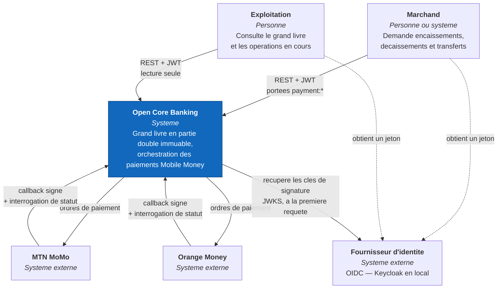
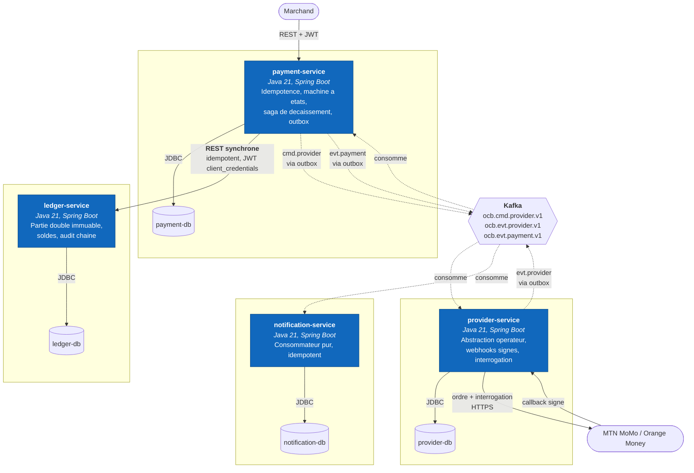
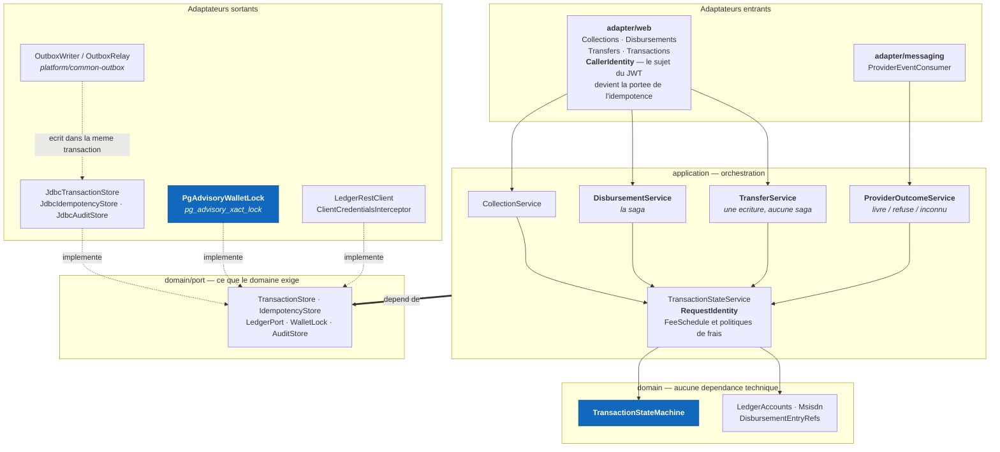
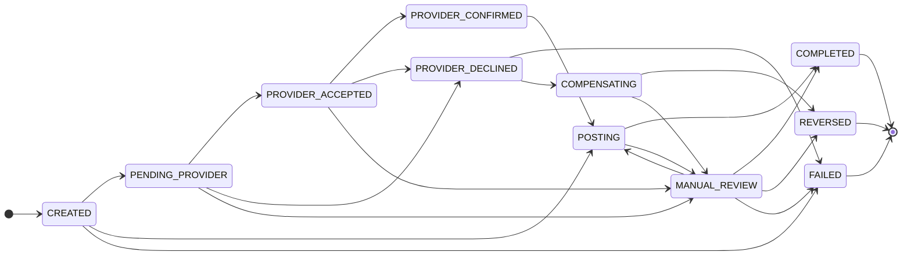
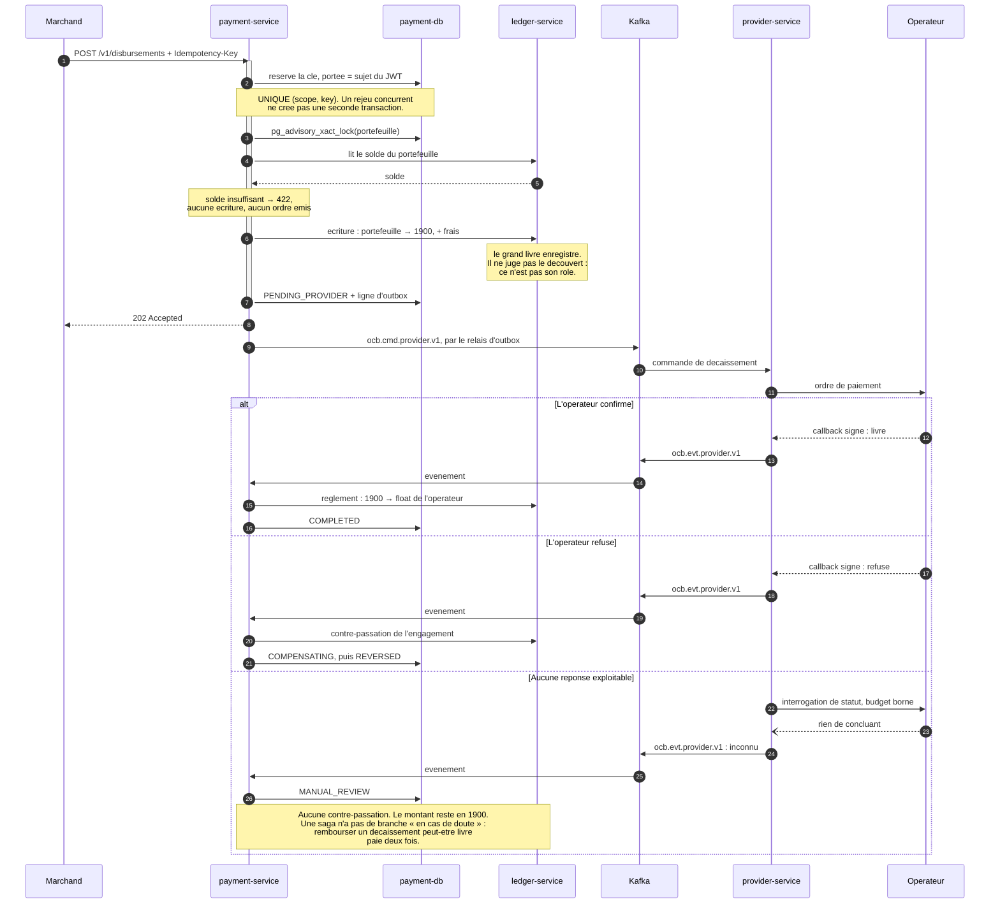

# Architecture

> Le systeme **tel qu'il est construit**. Pour le raisonnement qui a precede le code, lire
> le [document de cadrage de la Phase 0](00-architecture-phase0.md), conserve tel qu'il a
> ete ecrit.

Trois niveaux du modele C4 : contexte, conteneurs, composants.

**Le niveau 4 (code) est absent, deliberement.** Le code existe : un IDE le parcourt mieux
qu'un diagramme, et un diagramme de classes decroche du code au premier commit. Un schema
qui ment est pire qu'un schema absent.

**Le niveau 3 ne couvre que `payment-service`.** Les trois autres services ont une
structure que leur README decrit en quelques lignes ; en dessiner les composants
produirait quatre diagrammes dont trois seraient du remplissage. `payment-service` est
celui ou vivent la saga, l'outbox, la machine a etats et l'idempotence.

Les diagrammes sont en Mermaid, dans ce fichier. Pas d'images : une image se regenere a la
main, donc ne se regenere pas.

---

## Niveau 1 — Contexte

Qui parle au systeme, et a qui le systeme parle.

Deux traits de ce contexte comptent plus que les autres.

**Le systeme n'appelle jamais le fournisseur d'identite pour valider un jeton.** Il
recupere ses cles publiques et verifie les signatures localement. Un fournisseur
indisponible n'interrompt donc pas les paiements en cours ; il empeche seulement d'en
obtenir de nouveaux. La recuperation etant paresseuse, un service redemarre aussi pendant
une panne du fournisseur — ce qui est precisement le moment ou l'on en a besoin.

**Les operateurs repondent de deux facons, et aucune n'est fiable seule.** Un callback
peut ne jamais arriver ; une interrogation de statut peut rester sans reponse
exploitable. Les deux existent, et leur desaccord est un etat modelise, pas un imprevu.

---

## Niveau 2 — Conteneurs

| Conteneur | Detient | Expose |
|---|---|---|
| `ledger-service` | Plan de comptes, ecritures, lignes, instantanes de solde, journal d'audit chaine | REST : ouvrir un compte, passer une ecriture, lire un solde |
| `payment-service` | Transactions, cles d'idempotence, outbox, messages traites | REST : encaissement, decaissement, transfert, consultation |
| `provider-service` | Operations operateur, callbacks recus, outbox, messages traites | REST : lecture des operations. **Webhooks publics signes** |
| `notification-service` | Notifications emises, messages traites | REST : lecture des notifications |

### Une base par service, jamais partagee

Aucun service ne lit la base d'un autre. La regle est verifiee par ArchUnit, pas seulement
souhaitee : c'est ce qui empeche un monorepo de degenerer en monolithe distribue, ou
quatre deployables partagent un schema et ne peuvent plus evoluer separement.

Chaque base porte **deux utilisateurs** : celui qui possede le schema et applique les
migrations, celui qui fait tourner l'application. Le second n'a que `SELECT` et `INSERT`
sur les journaux — il ne peut donc pas retirer les garde-fous qui rendent le grand livre
immuable. Voir [le dossier de deploiement](../deploy/README.md).

### Un appel synchrone, et un seul

`payment-service` appelle `ledger-service` en **REST synchrone**, la seule liaison directe
entre deux services. La raison : le grand livre doit rendre un verdict immediat — le solde
suffit-il, l'ecriture est-elle equilibree. Une commande asynchrone obligerait l'appelant a
repondre `202` au marchand puis a decouvrir plus tard qu'il ne pouvait pas payer.

L'appel est idempotent, donc rejouable sans double ecriture. C'est ce qui rend acceptable
qu'il traverse le reseau au milieu d'une transaction metier.

### `ledger-service` ne parle pas Kafka

Il n'a aucune dependance au courtier — ni producteur, ni consommateur. Ce n'est pas un
oubli : rien n'a besoin d'etre notifie d'une ecriture comptable. Ce qui interesse le reste
du systeme, ce sont les evenements **metier** de `payment-service`, et ceux-la portent deja
l'information.

> Le contrat declare une constante `Topics.EVT_LEDGER = "ocb.evt.ledger.v1"` qui n'est
> **produite ni consommee nulle part**. C'est un topic prevu, pas un topic vivant, et il
> ne doit pas etre lu comme une liaison existante.

---

## Niveau 3 — Composants de `payment-service`

Structure hexagonale : le domaine ne connait aucune technologie, il declare des **ports** ;
les adaptateurs les implementent.

Quatre composants meritent d'etre lus avant les autres.

**`CallerIdentity`** transforme le sujet du JWT en portee d'idempotence. Sans lui, deux
marchands qui choisissent la meme cle — `commande-1`, par exemple — se verraient renvoyer
la transaction l'un de l'autre. La contrainte `UNIQUE (scope, key)` existait depuis la
Phase 2 ; c'est le controleur qui passait une constante.

**`RequestIdentity`** derive l'identifiant de transaction de `clientId + cle`, par
hachage, au lieu de le tirer au hasard. La raison est une fenetre de panne : l'ecriture au
grand livre est validee **a distance** avant la transaction locale. Un arret entre les deux
laissait un rejeu paraitre neuf, donc produisait une seconde reservation de fonds.

**`PgAdvisoryWalletLock`** serialise les decaissements d'un meme portefeuille. Un
`synchronized` aurait fonctionne sur une instance et echoue en silence des la deuxieme —
exactement ce que le deploiement en repliques rend possible. Le verrou vit dans la base,
et sa portee est la transaction : il est relache au commit **comme au rollback**.

**`TransactionStateMachine`** refuse les transitions qui n'ont pas de sens. Elle est dans
le domaine, sans dependance technique, et c'est elle — pas la base, pas le controleur — qui
decide si un decaissement peut passer de `PENDING_PROVIDER` a `COMPLETED`. Il ne le peut
pas.

---

## La machine a etats

Les etats terminaux n'ont aucune sortie. C'est ce qui rend `COMPLETED`, `FAILED` et
`REVERSED` definitifs, plutot que simplement rarement quittes.

`CREATED --> POSTING` est le chemin du **transfert**, qui ne passe par aucun operateur.
`MANUAL_REVIEW` a quatre sorties parce qu'un humain peut conclure dans les quatre sens —
c'est le seul etat dont on sort par une decision et non par un evenement.

---

## Un decaissement, de bout en bout

Le flux le plus difficile du systeme, avec ses trois issues.

Le compte **1900** est le registre d'avancement de la saga. Il n'existe aucune table
d'etat de saga : **tout montant qui stationne en 1900 est une question ouverte**, et son
solde est la liste des decaissements en vol. Un etat de saga stocke a cote de la
comptabilite pourrait diverger d'elle ; celui-ci ne le peut pas, puisqu'il *est* elle.

---

## Ce que ces diagrammes ne montrent pas

- **Aucune pile d'observabilite n'est deployee.** Les services exposent
  `/actuator/prometheus` avec des metriques metier ; il n'y a ni Grafana, ni traces
  distribuees. Le document de Phase 0 les annoncait ; ils n'ont pas ete faits.
- **Le relais d'outbox interroge la table.** Debezium etait prevu ; la table en respecte
  la convention, mais le remplacement n'a pas eu lieu.
- **Le chart Helm n'a jamais tourne sur un vrai cluster.** Il est verifie par rendu et par
  `kubeconform` a chaque push, ce qui valide les manifestes produits, pas leur
  comportement sous un ordonnanceur.
- **PostgreSQL, Kafka et Keycloak ne sont pas deployes par le chart.** Ce sont des systemes
  avec etat, dont l'exploitation ne ressemble pas a celle d'un service sans etat.
