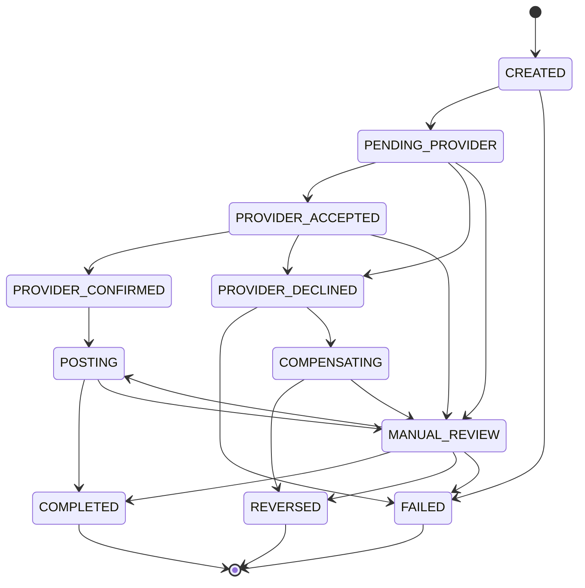

# payment-service

Orchestration des encaissements et decaissements Mobile Money. Idempotence stricte,
machine a etats a transitions gardees, Transactional Outbox.

Ce service ne detient aucune verite financiere — les soldes et les ecritures appartiennent
au [grand livre](../ledger-service/README.md). Il detient l'**etat d'avancement** d'une
operation, qui est une donnee differente et tout aussi critique : c'est elle qui dit si
l'argent a bouge, s'il est en vol, ou si personne ne sait.

Les decisions d'architecture qui le justifient sont dans
[docs/00-architecture-phase0.md](../../docs/00-architecture-phase0.md).

---

## Le numero du payeur n'est jamais conserve

C'est la decision de conception la plus importante de ce service, et elle s'ecarte
volontairement du cadrage initial, qui prevoyait un numero **chiffre au repos**.

**Ne pas conserver la donnee est plus fort que la chiffrer.**

Un numero chiffre reste un numero present. Il apparait dans les sauvegardes, part dans les
exports, se retrouve dans un dump de diagnostic, survit dans un environnement de recette
restaure depuis la production. Il impose une gestion de cles, une rotation, un plan de
reprise si la cle est perdue, et une reponse a la question « qui peut dechiffrer ». Chacun
de ces points est une occasion de se tromper.

Une donnee absente ne pose aucune de ces questions.

Concretement :

| Ou | Ce qui circule |
|---|---|
| Requete HTTP entrante | Numero complet — c'est l'appelant qui le fournit |
| `payment_transaction.masked_msisdn` | **Forme masquee uniquement** : `+2376****0001` |
| `ocb.cmd.provider.v1` | Numero complet, **une seule fois** : l'adaptateur operateur en a besoin pour appeler l'operateur |
| `ocb.evt.payment.v1` | Forme masquee |
| Journal d'audit | Forme masquee |
| Logs | Forme masquee |

Le type [`Msisdn`](src/main/java/com/ocb/payment/domain/Msisdn.java) rend le masquage
impossible a oublier : sa methode `toString()` — celle qu'appellent tous les frameworks de
journalisation, et celle qu'utilise la concatenation de chaines — rend deja la forme
masquee. Obtenir le numero complet demande un appel explicite a `full()`, qui se repere en
relecture et se cherche par `grep`.

Meme le message d'erreur d'un numero invalide ne contient aucun chiffre : ni la valeur
refusee, qui reste une donnee personnelle et finirait dans les logs d'erreur, ni un numero
d'exemple, qui rendrait impossible de verifier automatiquement qu'aucun numero ne fuite.

Trois tests verifient ces proprietes :
`MsisdnTest.toStringIsMasked`, `MsisdnTest.errorMessageDoesNotLeakTheValue`, et
`OutboxAtomicityIT.fullMsisdnOnlyInProviderCommand`.

**Contrepartie assumee.** Le service ne peut pas rejouer une commande operateur a partir de
ses seules donnees : le numero complet n'y est plus. C'est voulu. La retentative appartient
a `provider-service`, qui conserve ce dont il a besoin pour dialoguer avec l'operateur et
qui est le seul a en avoir l'usage.

---

## Ce que le service garantit

| Garantie | Comment elle est tenue | Ou c'est verifie |
|---|---|---|
| Une cle d'idempotence ne produit qu'une operation | `UNIQUE (scope, key)` + `ON CONFLICT DO NOTHING`, qui fait **attendre** la requete concurrente au lieu de la faire echouer | `IdempotencyIT` |
| Meme cle, contenu different, est refuse | Empreinte de requete comparee au rejeu | `IdempotencyIT` |
| Aucun changement d'etat hors machine a etats | Point de passage unique, verrou pessimiste sur la ligne | `TransactionStateMachineTest` |
| Un callback tardif ou duplique ne change rien | Etats terminaux sans transition sortante | `TransactionStateMachineTest` |
| Les refus de transition sont tracables | `transaction_state_transition` append-only, exposee par l'API | migration `V3` |
| Un evenement et sa donnee metier sont atomiques | Outbox dans la transaction metier | `OutboxAtomicityIT` |
| Un timeout n'est jamais un echec | `MANUAL_REVIEW` inaccessible depuis `FAILED`, et reciproquement | `TransactionStateMachineTest` |

---

## La machine a etats



Trois proprietes a retenir.

**`MANUAL_REVIEW` n'est pas un echec.** Il signale qu'aucune conclusion n'a pu etre tiree,
typiquement parce que l'operateur n'a jamais repondu. L'argent a peut-etre bouge. Le ranger
avec `FAILED` transformerait une incertitude en certitude fausse et declencherait un
remboursement pour un paiement qui a peut-etre reussi. C'est pourquoi aucune transition ne
mene directement de `PENDING_PROVIDER` ou `PROVIDER_ACCEPTED` vers `FAILED`.

**On ne peut pas atteindre `COMPLETED` sans passer par `POSTING`.** Sans cette
interdiction, un bug pourrait declarer une transaction terminee alors qu'aucune ecriture
n'existe : l'argent aurait bouge chez l'operateur sans jamais apparaitre au grand livre.

**Les etats terminaux n'ont aucune sortie.** C'est cette absence, et non un controle ecrit
quelque part, qui neutralise les callbacks tardifs. Le test parcourt les **121 paires**
d'etats possibles et compare le comportement reel a la table declaree.

---

## Deux niveaux de deduplication, pas un

Ils repondent a deux problemes distincts et aucun ne remplace l'autre.

- **Doublon technique** — le meme message reemis, avec le meme `eventId`. Kafka livre au
  moins une fois : un redemarrage entre le traitement et la validation de l'offset le fait
  redelivrer. Arrete par `processed_message`, dont l'insertion a lieu **dans la meme
  transaction que l'effet metier, et avant lui**.
- **Doublon logique** — deux messages *differents*, avec des `eventId` differents, qui
  decrivent le meme fait. Typiquement un callback operateur et le resultat d'un polling qui
  arrivent ensemble. La deduplication ne les voit pas passer ; seule la machine a etats les
  neutralise.

---

## La saga de decaissement

Un encaissement n'ecrit au grand livre qu'**apres** confirmation de l'operateur. Tant que
rien n'est confirme, rien n'a bouge, et un refus se solde par un simple echec. Il n'y a
rien a defaire, donc rien qui ressemble a une saga.

Un decaissement ne peut pas fonctionner ainsi : **on n'envoie pas de l'argent qu'on n'a pas
preleve**. Les fonds quittent donc le portefeuille avant l'appel a l'operateur. C'est cette
inversion, et elle seule, qui cree quelque chose a compenser.

```
CREATED
  |-- ecriture 1 : engagement       DR 2100.wallet (montant + frais)
  |                                 CR 1900 (montant)   CR 4100 (frais)
PENDING_PROVIDER --> PROVIDER_ACCEPTED --> PROVIDER_CONFIRMED
        |                                    |-- POSTING
        |                                    |-- ecriture 2 : livraison
        |                                    |   DR 1900   DR 5100   CR 1100
        |                                    '-- COMPLETED
        |
        '--> PROVIDER_DECLINED --> COMPENSATING --> contre-passation --> REVERSED
```

### Le compte 1900 est l'etat d'avancement

Les fonds engages ne partent pas dans le vide : ils stationnent sur le compte de passage
`1900`. De la, ils repartent vers le float de l'operateur a la livraison, ou reviennent au
client par contre-passation.

Il n'existe donc **aucune table de sagas en cours**, et c'est delibere : le grand livre en
tient deja le registre. **Tout montant qui stationne en 1900 est une question ouverte**, et
le solde de ce compte est, a tout instant, la liste des decaissements en vol. Une table
parallele serait une seconde source de verite a maintenir en accord avec la premiere, ce
qui est exactement le genre de duplication qui finit par diverger sans que rien ne le
signale.

### Une saga n'a pas de branche « en cas de doute »

C'est le point le plus important de cette conception, et celui qu'une saga naive rate.

Quand l'operateur ne conclut pas — budget de relance epuise, silence prolonge — la
tentation est de compenser : la transaction traine, on rend l'argent, on ferme le dossier.
Ce serait une faute. **L'operateur a peut-etre paye le beneficiaire.** Rembourser le client
ferait alors sortir l'argent deux fois, et aucune ecriture ne le signalerait : les deux
mouvements seraient parfaitement equilibres et parfaitement legitimes pris separement.

Une saga compense un echec **avere**, jamais une incertitude. Un decaissement `UNRESOLVED`
passe donc en `MANUAL_REVIEW`, fonds laisses en 1900, avec toutes les tentatives
consignees. Ce n'est pas un trou dans la conception : c'est le refus d'inventer une
information qu'on n'a pas, exactement comme `provider-service` refuse de conclure sur un
delai depasse.

La contre-passation rend aussi **nos frais de plateforme**, puisqu'elle inverse les trois
lignes de l'engagement. Facturer la prise en charge d'un ordre que l'operateur a refuse
serait indefendable.

### Les references d'ecriture sont derivees, pas retrouvees

`DISB-RES-{transactionId}`, `DISB-SET-{transactionId}`, `DISB-REV-{transactionId}`.

L'etape qui compense s'execute potentiellement des heures plus tard, dans un autre
processus, apres une redelivraison de message : une reference conservee en base serait une
chose de plus a ne pas perdre. Une reference calculee ne peut pas manquer.

Elles servent aussi de second garde-fou d'idempotence, en plus de la cle : le grand livre
refuse deux ecritures de meme reference.

### L'identifiant de transaction aussi

Un decaissement ecrit au grand livre — service distant, qui valide immediatement — **avant**
de valider sa propre transaction. C'est une double ecriture, et elle laisse une fenetre : si
le processus meurt entre les deux, notre transaction est annulee, reservation de cle
d'idempotence comprise, tandis que l'ecriture comptable subsiste.

Le client, qui a vu un timeout, rejoue avec la meme cle. Ne trouvant plus aucune
reservation, la demande repart comme neuve. Avec un identifiant tire au hasard, elle
produirait une **seconde** ecriture d'engagement : le portefeuille serait debite deux fois,
et rien ne le signalerait — les deux ecritures sont equilibrees et legitimes prises
separement.

L'identifiant est donc derive de l'appelant et de sa cle d'idempotence
(`RequestIdentity`). Le rejeu retombe sur le meme identifiant, donc sur la meme cle et la
meme reference d'ecriture ; le grand livre reconnait la sienne et la rend telle quelle.
L'etat converge au lieu de diverger.

**Uniquement la ou un effet externe precede la validation locale** — decaissement,
transfert. Un encaissement n'appelle personne avant de valider : son annulation ne laisse
aucune trace, et un identifiant aleatoire y reste correct. Generaliser la mecanique
laisserait croire qu'elle protege d'autre chose.

`DisbursementCrashRecoveryIT` execute la demande dans une transaction marquee pour
annulation — la doublure de grand livre n'y participe pas, comme un vrai appel REST — puis
rejoue. Verifie dans les deux sens : identifiant aleatoire, le portefeuille est debite deux
fois.

---

## Le decouvert est interdit ici, pas dans le grand livre

Le grand livre enregistre ce qui s'est passe ; il ne refuse pas. Lui confier l'interdiction
du decouvert l'empecherait un jour d'enregistrer un solde negatif parfaitement legitime :
frais appliques apres coup, regularisation, correction. Ce n'est pas son role de decider.

La regle vit donc ici. Et elle pose un probleme que sa formulation naive ignore : interdire
le decouvert suppose de **lire un solde puis d'ecrire en fonction de ce qu'on a lu**. Entre
les deux, un second decaissement sur le meme portefeuille peut lire le meme solde et se
croire finançable lui aussi. Les deux ecritures passent, et le portefeuille se retrouve a
decouvert sans qu'aucune des deux demandes, prise isolement, n'ait enfreint la regle.

**Le verrou est en base, jamais en memoire.** Un `synchronized` ou un `ReentrantLock`
protege une instance. Des qu'il y en a deux — ce que l'externalisation des groupes de
consommation rend possible, et ce que Kubernetes rendra normal — la garantie disparait sans
le moindre signal : le code continue de verrouiller, simplement plus rien n'est serialise
entre les instances. Une protection qui s'evapore en silence est pire qu'une absence de
protection, parce qu'on cesse d'y penser.

`PgAdvisoryWalletLock` prend un `pg_advisory_xact_lock` derive du numero de portefeuille.
Portee **transaction** : la base relache a la validation comme a l'annulation, ce qui evite
qu'un verrou de session survive a une annulation sur une connexion rendue au pool. Et il
refuse de s'executer hors transaction, ou il serait pris puis relache a l'instruction
suivante — donc ne protegerait rien, sans qu'aucune erreur ne le signale.

Le solde lu fait foi : `rawBalanceOf` part de l'instantane **et** ajoute les ecritures
posterieures. L'instantane n'est qu'un cache.

### Verifie sous concurrence reelle

`DisbursementConcurrencyIT` lance trente-deux demandes au meme instant sur le meme
portefeuille, chacune avec une cle d'idempotence **differente** — aucune n'est le rejeu
d'une autre, l'idempotence ne peut donc pas les departager a la place du verrou — sur un
portefeuille qui ne peut en financer qu'**une seule**.

Le test a ete verifie dans les deux sens : verrou retire, **dix** demandes passent et le
portefeuille tombe a -45 450 XAF. Sans cette contre-epreuve, un test vert n'aurait rien
prouve.

---

## Le transfert de portefeuille a portefeuille n'a pas de saga

Et ce n'est pas un oubli. Un transfert entre deux portefeuilles est une **seule ecriture
equilibree** : `DR 2100.wallet-A`, `CR 2100.wallet-B`. Il ne traverse aucune frontiere de
service, n'appelle aucun systeme que nous ne controlons pas, et se joue entierement dans
une transaction ACID du grand livre.

Lui ajouter une saga — etapes intermediaires, compte de passage, compensation — serait de
la mise en scene : on paierait la complexite d'un protocole distribue pour un probleme qui
n'en est pas un. Une saga se justifie quand l'atomicite est **impossible**, pas quand elle
est simplement disponible.

C'est la contrepartie utile du decaissement : elle montre que la saga y est presente parce
qu'elle y est necessaire, et non par gout du motif.

---

## Prerequis

- JDK 21
- Docker, pour PostgreSQL, Kafka et les tests d'integration
- Maven n'est pas necessaire : utilisez le wrapper (`./mvnw`)

---

## Lancer les dependances locales

```bash
docker run -d --name ocb-payment-db -e POSTGRES_USER=payment_owner -e POSTGRES_PASSWORD=owner-secret -e POSTGRES_DB=payment -p 5433:5432 postgres:16-alpine
```

```bash
docker exec ocb-payment-db psql -U payment_owner -d payment -c "CREATE ROLE payment_app LOGIN PASSWORD 'app-secret';"
```

Kafka est necessaire pour le flux complet, et un fournisseur OIDC pour obtenir un jeton. En
Phase 5, un Docker Compose remplacera ces commandes et fournira un realm Keycloak
pre-configure.

---

## Demarrer le service

```bash
./mvnw -pl services/payment-service -am spring-boot:run
```

Le service ecoute sur `http://localhost:8082` et attend le grand livre sur
`http://localhost:8081`.

---

## Tester

```bash
./mvnw -pl services/payment-service -am test
```

```bash
./mvnw -pl services/payment-service -am verify
```

`test` execute les 158 tests unitaires, sans aucune infrastructure. `verify` ajoute les
tests d'integration, qui demandent un daemon Docker.

Les tests d'integration sont volontairement separes selon qu'ils ont besoin de Kafka.
L'idempotence sous concurrence et l'atomicite de l'outbox sont des proprietes de la
**base** : les verifier a travers un bus ajouterait de l'asynchronisme, donc des attentes
et de l'intermittence, sans rien prouver de plus.

### Le flux complet

`CollectionFlowIT` traverse reellement la chaine — outbox, relais, Kafka, operateur
simule, grand livre bouchonne — et couvre six scenarios :

| # | Scenario | Ce qu'il demontre |
|---|---|---|
| S1 | Encaissement nominal | Sequence d'etats **exacte**, ecriture equilibree a quatre lignes, un seul appel au grand livre |
| S2 | Refus operateur | Echec, et surtout **zero ecriture** : un encaissement refuse n'a rien engage |
| S3 | Doublon **logique** | Deux succes aux `eventId` differents, une seule ecriture. Seule la machine a etats peut l'arreter |
| S4 | Silence de l'operateur | La transaction attend, elle n'echoue **jamais** |
| S5 | Doublon **technique** | Meme `eventId` rejoue, un seul effet. Seule la deduplication l'arrete |
| S6 | Grand livre injoignable | Retentative, aucune conclusion hative, une seule ecriture malgre plusieurs appels |

Deux points de methode y sont expliques en commentaire plutot que seulement appliques.

**La sequence d'etats de S1 est asserte exactement**, et non par presence des etapes. Cela
verifie la garantie d'ordre par cle de partition : si la confirmation arrivait avant
l'accuse de reception, la machine a etats refuserait la transition et la sequence ne
correspondrait plus.

**La transaction-barriere de S4** repond au cas le plus difficile d'un test asynchrone :
prouver qu'il ne se passe rien. Aucune attente ne le demontre, puisqu'on aura toujours pu
attendre trop peu. Le raisonnement tient sur deux jambes — avoir observe `PROVIDER_ACCEPTED`
prouve que l'operateur simule a **termine** de traiter la commande, et une seconde
transaction menee jusqu'a `COMPLETED` prouve que la chaine a ete **drainee** au-dela. On
n'affirme pas « rien n'est arrive parce qu'on a attendu », mais « rien ne peut arriver, et
le tuyau est vide ».

---

## Exemple : un encaissement

```bash
curl -X POST http://localhost:8082/v1/collections -H 'Content-Type: application/json' -H 'Idempotency-Key: collect-001' -d '{"externalRef":"TX-001","amount":"10000","currency":"XAF","payerMsisdn":"+237670000001","walletAccountRef":"2100.wallet-c","providerCode":"MTN_MOMO"}'
```

La reponse est un `202`, pas un `200` : la demande est **prise en charge**, elle n'est pas
terminee. Un paiement Mobile Money attend l'approbation du client sur son telephone ;
pretendre rendre un resultat obligerait a inventer une issue en cas de timeout.

Rejouer exactement la meme commande rend un `200` et la meme transaction, sans declencher
un second prelevement.

```bash
curl http://localhost:8082/v1/transactions/{transactionId}
```

```bash
curl http://localhost:8082/v1/transactions/{transactionId}/transitions
```

Le second appel expose l'historique complet, **y compris les transitions refusees**. Un
callback tardif ou duplique y apparait avec `accepted: false` et le motif du refus : c'est
la preuve, en base et non dans un log, qu'un doublon a bien ete neutralise.

---

## Operateur simule

Echafaudage de Phase 2, retire en Phase 3 quand `provider-service` prendra sa place sur les
memes topics, sans qu'aucun contrat ne change.

Le comportement est pilote par les deux derniers chiffres du montant, convention reellement
utilisee par les bacs a sable des prestataires de paiement : elle evite d'ajouter une API
d'administration juste pour tester, et rend les recettes reproductibles.

| Montant termine par | Comportement |
|---|---|
| `98` | L'operateur refuse |
| `97` | L'operateur accepte puis ne conclut jamais — cas du timeout |
| `96` | Le succes est publie **deux fois**, avec des `eventId` differents |
| autre | Succes, commission operateur de 1,5 % |

Le cas `97` est le plus instructif : la transaction reste en attente et ne bascule
**jamais** en echec. L'argent a peut-etre bouge, seul le polling de la Phase 3 tranchera.

---

## Codes d'erreur

| Code | Statut | Signification |
|---|---|---|
| `PAYMENT_IDEMPOTENCY_KEY_REUSED` | 422 | Meme cle, contenu different — bug appelant, pas un rejeu |
| `PAYMENT_REQUEST_IN_PROGRESS` | 409 | Une requete portant cette cle est en vol ; reessayer |
| `PAYMENT_INVALID_AMOUNT` | 422 | Les frais absorberaient la totalite du montant |
| `PAYMENT_INSUFFICIENT_FUNDS` | 422 | Le portefeuille ne couvre pas le montant augmente des frais |
| `PAYMENT_INVALID_MSISDN` | 422 | Numero mal forme |
| `PAYMENT_LEDGER_REJECTED` | 422 | Le grand livre a refuse l'ecriture |
| `PAYMENT_TRANSACTION_NOT_FOUND` | 404 | Transaction inconnue |

---

## Identite de l'appelant

Le service est un serveur de ressources OIDC : `payment:initiate` pour demander un
encaissement, `payment:read` pour consulter. Une portee reconnue ailleurs sur la plateforme
ne vaut rien ici, et l'audience du jeton est verifiee en plus de sa signature.

**L'identite de l'appelant fait partie de la cle d'idempotence.** C'est la consequence la
moins evidente de l'authentification, et elle corrige une faille reelle : les cles sont
choisies par le client, et rien n'empeche un client d'utiliser un compteur plutot qu'un
identifiant aleatoire. Deux marchands finiraient donc par proposer `paiement-1`. Sans
cloisonnement, le second recevrait la transaction du premier avec un statut d'apparence
normale et croirait sa demande prise en charge alors qu'elle aurait ete purement ignoree —
un encaissement perdu, sans erreur nulle part.

La contrainte `UNIQUE (scope, key)` existait des la Phase 2 ; la portee reelle n'est
arrivee qu'avec l'authentification, faute d'identite verifiable avant. Elle vient du jeton,
jamais d'un en-tete : un en-tete non verifie donnerait une fausse impression d'isolation,
puisque n'importe qui pourrait s'y declarer n'importe qui et lire par simple collision de
cle les transactions d'un autre marchand.

Trois tests verrouillent cela : deux sujets differents avec la meme cle obtiennent bien
deux transactions distinctes ; le meme sujet qui rejoue retrouve la sienne — contre-epreuve
sans laquelle le premier test passerait tout aussi bien si l'idempotence avait cesse de
fonctionner ; et un montant different sous la cle d'un autre ne remonte aucun conflit, un
message d'erreur revelant a lui seul l'existence de la transaction voisine.

### Vers le grand livre

`payment-service` s'authentifie **en tant que lui-meme** aupres du grand livre, par
`client_credentials`, et non au nom du marchand appelant. L'ecriture comptable est sa
decision, prise apres validation du montant, des frais et de l'etat de la transaction.
Propager le jeton du marchand lui accorderait indirectement `ledger:post`, c'est-a-dire le
pouvoir de se crediter lui-meme.

---

## Limites assumees

- **Le relais d'outbox tourne en une seule instance.** Plusieurs relais concurrents
  pourraient publier deux evenements d'un meme agregat dans le desordre. L'ordre par
  agregat ne depend cependant pas du relais mais du verrou pessimiste sur la ligne de la
  transaction, qui serialise les ecritures et leur donne des numeros croissants.
- **L'appel au grand livre se fait sous verrou.** La transaction locale tient le verrou de
  ligne pendant l'appel HTTP. Acceptable a cette echelle, avec un delai de lecture court
  volontairement ; a surveiller si la latence du grand livre augmente.
- **Le controle de solde appelle le grand livre sous verrou.** Le verrou de portefeuille
  est tenu pendant la lecture du solde et pendant l'ecriture d'engagement, donc pendant deux
  appels HTTP. C'est le prix de l'absence de fenetre entre le controle et l'ecriture qui le
  consomme. A surveiller si la latence du grand livre augmente ; la contention se mesure par
  portefeuille, pas globalement.
- **Un decaissement `UNRESOLVED` immobilise des fonds.** Ils restent en 1900 jusqu'a
  arbitrage humain. Le filet naturel est la reconciliation de releve — comparer le releve
  quotidien de l'operateur a nos ecritures — prevue apres la Phase 5.
- **Pas de transfert de portefeuille a portefeuille.** Phase 4b.
