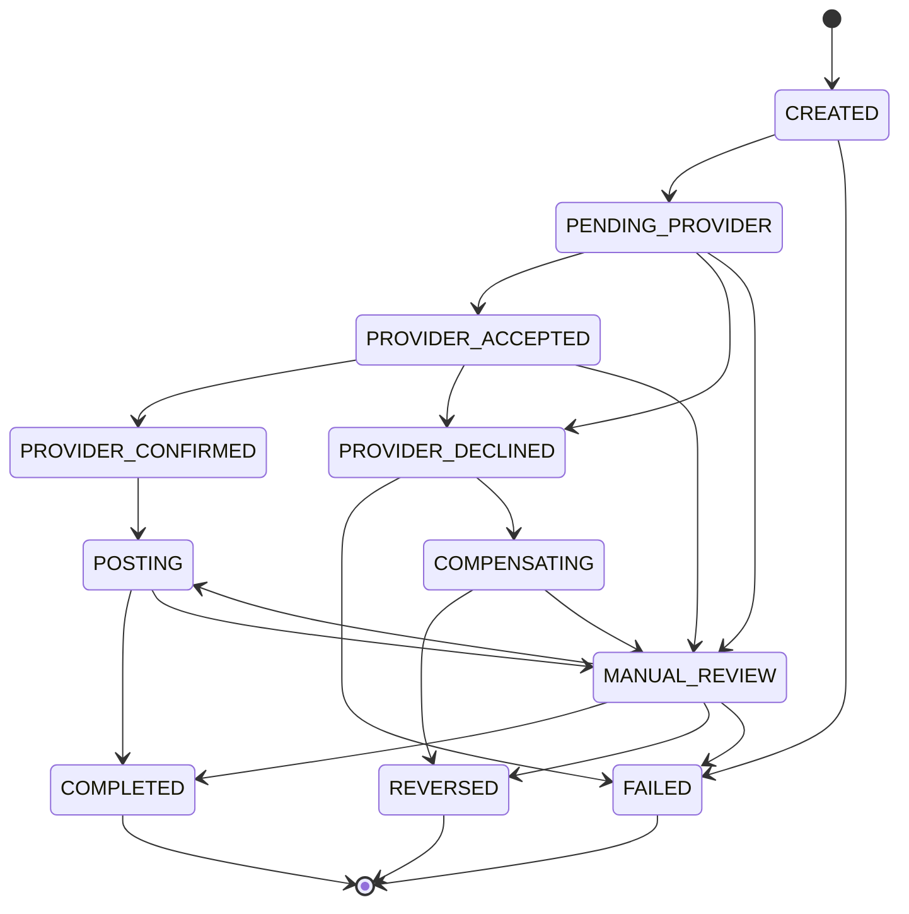

# payment-service

Orchestration des encaissements et decaissements Mobile Money. Idempotence stricte,
machine a etats a transitions gardees, Transactional Outbox.

Ce service ne detient aucune verite financiere — les soldes et les ecritures appartiennent
au [grand livre](../ledger-service/README.md). Il detient l'**etat d'avancement** d'une
operation, qui est une donnee differente et tout aussi critique : c'est elle qui dit si
l'argent a bouge, s'il est en vol, ou si personne ne sait.

Les decisions d'architecture qui le justifient sont dans
[docs/00-architecture-phase0.md](../../docs/00-architecture-phase0.md).

---

## Le numero du payeur n'est jamais conserve

C'est la decision de conception la plus importante de ce service, et elle s'ecarte
volontairement du cadrage initial, qui prevoyait un numero **chiffre au repos**.

**Ne pas conserver la donnee est plus fort que la chiffrer.**

Un numero chiffre reste un numero present. Il apparait dans les sauvegardes, part dans les
exports, se retrouve dans un dump de diagnostic, survit dans un environnement de recette
restaure depuis la production. Il impose une gestion de cles, une rotation, un plan de
reprise si la cle est perdue, et une reponse a la question « qui peut dechiffrer ». Chacun
de ces points est une occasion de se tromper.

Une donnee absente ne pose aucune de ces questions.

Concretement :

| Ou | Ce qui circule |
|---|---|
| Requete HTTP entrante | Numero complet — c'est l'appelant qui le fournit |
| `payment_transaction.masked_msisdn` | **Forme masquee uniquement** : `+2376****0001` |
| `ocb.cmd.provider.v1` | Numero complet, **une seule fois** : l'adaptateur operateur en a besoin pour appeler l'operateur |
| `ocb.evt.payment.v1` | Forme masquee |
| Journal d'audit | Forme masquee |
| Logs | Forme masquee |

Le type [`Msisdn`](src/main/java/com/ocb/payment/domain/Msisdn.java) rend le masquage
impossible a oublier : sa methode `toString()` — celle qu'appellent tous les frameworks de
journalisation, et celle qu'utilise la concatenation de chaines — rend deja la forme
masquee. Obtenir le numero complet demande un appel explicite a `full()`, qui se repere en
relecture et se cherche par `grep`.

Meme le message d'erreur d'un numero invalide ne contient aucun chiffre : ni la valeur
refusee, qui reste une donnee personnelle et finirait dans les logs d'erreur, ni un numero
d'exemple, qui rendrait impossible de verifier automatiquement qu'aucun numero ne fuite.

Trois tests verifient ces proprietes :
`MsisdnTest.toStringIsMasked`, `MsisdnTest.errorMessageDoesNotLeakTheValue`, et
`OutboxAtomicityIT.fullMsisdnOnlyInProviderCommand`.

**Contrepartie assumee.** Le service ne peut pas rejouer une commande operateur a partir de
ses seules donnees : le numero complet n'y est plus. C'est voulu. La retentative appartient
a `provider-service`, qui conserve ce dont il a besoin pour dialoguer avec l'operateur et
qui est le seul a en avoir l'usage.

---

## Ce que le service garantit

| Garantie | Comment elle est tenue | Ou c'est verifie |
|---|---|---|
| Une cle d'idempotence ne produit qu'une operation | `UNIQUE (scope, key)` + `ON CONFLICT DO NOTHING`, qui fait **attendre** la requete concurrente au lieu de la faire echouer | `IdempotencyIT` |
| Meme cle, contenu different, est refuse | Empreinte de requete comparee au rejeu | `IdempotencyIT` |
| Aucun changement d'etat hors machine a etats | Point de passage unique, verrou pessimiste sur la ligne | `TransactionStateMachineTest` |
| Un callback tardif ou duplique ne change rien | Etats terminaux sans transition sortante | `TransactionStateMachineTest` |
| Les refus de transition sont tracables | `transaction_state_transition` append-only, exposee par l'API | migration `V3` |
| Un evenement et sa donnee metier sont atomiques | Outbox dans la transaction metier | `OutboxAtomicityIT` |
| Un timeout n'est jamais un echec | `MANUAL_REVIEW` inaccessible depuis `FAILED`, et reciproquement | `TransactionStateMachineTest` |

---

## La machine a etats



Trois proprietes a retenir.

**`MANUAL_REVIEW` n'est pas un echec.** Il signale qu'aucune conclusion n'a pu etre tiree,
typiquement parce que l'operateur n'a jamais repondu. L'argent a peut-etre bouge. Le ranger
avec `FAILED` transformerait une incertitude en certitude fausse et declencherait un
remboursement pour un paiement qui a peut-etre reussi. C'est pourquoi aucune transition ne
mene directement de `PENDING_PROVIDER` ou `PROVIDER_ACCEPTED` vers `FAILED`.

**On ne peut pas atteindre `COMPLETED` sans passer par `POSTING`.** Sans cette
interdiction, un bug pourrait declarer une transaction terminee alors qu'aucune ecriture
n'existe : l'argent aurait bouge chez l'operateur sans jamais apparaitre au grand livre.

**Les etats terminaux n'ont aucune sortie.** C'est cette absence, et non un controle ecrit
quelque part, qui neutralise les callbacks tardifs. Le test parcourt les **121 paires**
d'etats possibles et compare le comportement reel a la table declaree.

---

## Deux niveaux de deduplication, pas un

Ils repondent a deux problemes distincts et aucun ne remplace l'autre.

- **Doublon technique** — le meme message reemis, avec le meme `eventId`. Kafka livre au
  moins une fois : un redemarrage entre le traitement et la validation de l'offset le fait
  redelivrer. Arrete par `processed_message`, dont l'insertion a lieu **dans la meme
  transaction que l'effet metier, et avant lui**.
- **Doublon logique** — deux messages *differents*, avec des `eventId` differents, qui
  decrivent le meme fait. Typiquement un callback operateur et le resultat d'un polling qui
  arrivent ensemble. La deduplication ne les voit pas passer ; seule la machine a etats les
  neutralise.

---

## Prerequis

- JDK 21
- Docker, pour PostgreSQL, Kafka et les tests d'integration
- Maven n'est pas necessaire : utilisez le wrapper (`./mvnw`)

---

## Lancer les dependances locales

```bash
docker run -d --name ocb-payment-db -e POSTGRES_USER=payment_owner -e POSTGRES_PASSWORD=owner-secret -e POSTGRES_DB=payment -p 5433:5432 postgres:16-alpine
```

```bash
docker exec ocb-payment-db psql -U payment_owner -d payment -c "CREATE ROLE payment_app LOGIN PASSWORD 'app-secret';"
```

Kafka est necessaire pour le flux complet. En Phase 5, un Docker Compose remplacera ces
commandes.

---

## Demarrer le service

```bash
./mvnw -pl services/payment-service -am spring-boot:run
```

Le service ecoute sur `http://localhost:8082` et attend le grand livre sur
`http://localhost:8081`.

---

## Tester

```bash
./mvnw -pl services/payment-service -am test
```

```bash
./mvnw -pl services/payment-service -am verify
```

`test` execute les 158 tests unitaires, sans aucune infrastructure. `verify` ajoute les
tests d'integration, qui demandent un daemon Docker.

Les tests d'integration sont volontairement separes selon qu'ils ont besoin de Kafka.
L'idempotence sous concurrence et l'atomicite de l'outbox sont des proprietes de la
**base** : les verifier a travers un bus ajouterait de l'asynchronisme, donc des attentes
et de l'intermittence, sans rien prouver de plus.

### Le flux complet

`CollectionFlowIT` traverse reellement la chaine — outbox, relais, Kafka, operateur
simule, grand livre bouchonne — et couvre six scenarios :

| # | Scenario | Ce qu'il demontre |
|---|---|---|
| S1 | Encaissement nominal | Sequence d'etats **exacte**, ecriture equilibree a quatre lignes, un seul appel au grand livre |
| S2 | Refus operateur | Echec, et surtout **zero ecriture** : un encaissement refuse n'a rien engage |
| S3 | Doublon **logique** | Deux succes aux `eventId` differents, une seule ecriture. Seule la machine a etats peut l'arreter |
| S4 | Silence de l'operateur | La transaction attend, elle n'echoue **jamais** |
| S5 | Doublon **technique** | Meme `eventId` rejoue, un seul effet. Seule la deduplication l'arrete |
| S6 | Grand livre injoignable | Retentative, aucune conclusion hative, une seule ecriture malgre plusieurs appels |

Deux points de methode y sont expliques en commentaire plutot que seulement appliques.

**La sequence d'etats de S1 est asserte exactement**, et non par presence des etapes. Cela
verifie la garantie d'ordre par cle de partition : si la confirmation arrivait avant
l'accuse de reception, la machine a etats refuserait la transition et la sequence ne
correspondrait plus.

**La transaction-barriere de S4** repond au cas le plus difficile d'un test asynchrone :
prouver qu'il ne se passe rien. Aucune attente ne le demontre, puisqu'on aura toujours pu
attendre trop peu. Le raisonnement tient sur deux jambes — avoir observe `PROVIDER_ACCEPTED`
prouve que l'operateur simule a **termine** de traiter la commande, et une seconde
transaction menee jusqu'a `COMPLETED` prouve que la chaine a ete **drainee** au-dela. On
n'affirme pas « rien n'est arrive parce qu'on a attendu », mais « rien ne peut arriver, et
le tuyau est vide ».

---

## Exemple : un encaissement

```bash
curl -X POST http://localhost:8082/v1/collections -H 'Content-Type: application/json' -H 'Idempotency-Key: collect-001' -d '{"externalRef":"TX-001","amount":"10000","currency":"XAF","payerMsisdn":"+237670000001","walletAccountRef":"2100.wallet-c","providerCode":"MTN_MOMO"}'
```

La reponse est un `202`, pas un `200` : la demande est **prise en charge**, elle n'est pas
terminee. Un paiement Mobile Money attend l'approbation du client sur son telephone ;
pretendre rendre un resultat obligerait a inventer une issue en cas de timeout.

Rejouer exactement la meme commande rend un `200` et la meme transaction, sans declencher
un second prelevement.

```bash
curl http://localhost:8082/v1/transactions/{transactionId}
```

```bash
curl http://localhost:8082/v1/transactions/{transactionId}/transitions
```

Le second appel expose l'historique complet, **y compris les transitions refusees**. Un
callback tardif ou duplique y apparait avec `accepted: false` et le motif du refus : c'est
la preuve, en base et non dans un log, qu'un doublon a bien ete neutralise.

---

## Operateur simule

Echafaudage de Phase 2, retire en Phase 3 quand `provider-service` prendra sa place sur les
memes topics, sans qu'aucun contrat ne change.

Le comportement est pilote par les deux derniers chiffres du montant, convention reellement
utilisee par les bacs a sable des prestataires de paiement : elle evite d'ajouter une API
d'administration juste pour tester, et rend les recettes reproductibles.

| Montant termine par | Comportement |
|---|---|
| `98` | L'operateur refuse |
| `97` | L'operateur accepte puis ne conclut jamais — cas du timeout |
| `96` | Le succes est publie **deux fois**, avec des `eventId` differents |
| autre | Succes, commission operateur de 1,5 % |

Le cas `97` est le plus instructif : la transaction reste en attente et ne bascule
**jamais** en echec. L'argent a peut-etre bouge, seul le polling de la Phase 3 tranchera.

---

## Codes d'erreur

| Code | Statut | Signification |
|---|---|---|
| `PAYMENT_IDEMPOTENCY_KEY_REUSED` | 422 | Meme cle, contenu different — bug appelant, pas un rejeu |
| `PAYMENT_REQUEST_IN_PROGRESS` | 409 | Une requete portant cette cle est en vol ; reessayer |
| `PAYMENT_INVALID_AMOUNT` | 422 | Les frais absorberaient la totalite du montant |
| `PAYMENT_INVALID_MSISDN` | 422 | Numero mal forme |
| `PAYMENT_LEDGER_REJECTED` | 422 | Le grand livre a refuse l'ecriture |
| `PAYMENT_TRANSACTION_NOT_FOUND` | 404 | Transaction inconnue |

---

## Limites assumees en Phase 2

- **Aucune authentification.** La portee des cles d'idempotence vaut `anonymous` pour tous
  les appelants. En Phase 3, ce sera le sujet du JWT : deux clients qui choisissent la meme
  cle ne doivent pas se voler mutuellement leurs reponses. L'inventer aujourd'hui a partir
  d'un en-tete non verifie donnerait une fausse impression d'isolation.
- **Le relais d'outbox tourne en une seule instance.** Plusieurs relais concurrents
  pourraient publier deux evenements d'un meme agregat dans le desordre. L'ordre par
  agregat ne depend cependant pas du relais mais du verrou pessimiste sur la ligne de la
  transaction, qui serialise les ecritures et leur donne des numeros croissants.
- **L'appel au grand livre se fait sous verrou.** La transaction locale tient le verrou de
  ligne pendant l'appel HTTP. Acceptable a cette echelle, avec un delai de lecture court
  volontairement ; a surveiller si la latence du grand livre augmente.
- **Pas de decaissement, pas de saga.** Phase 4.
